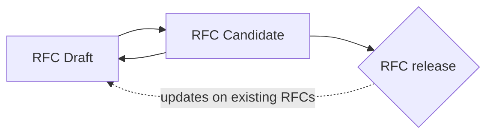
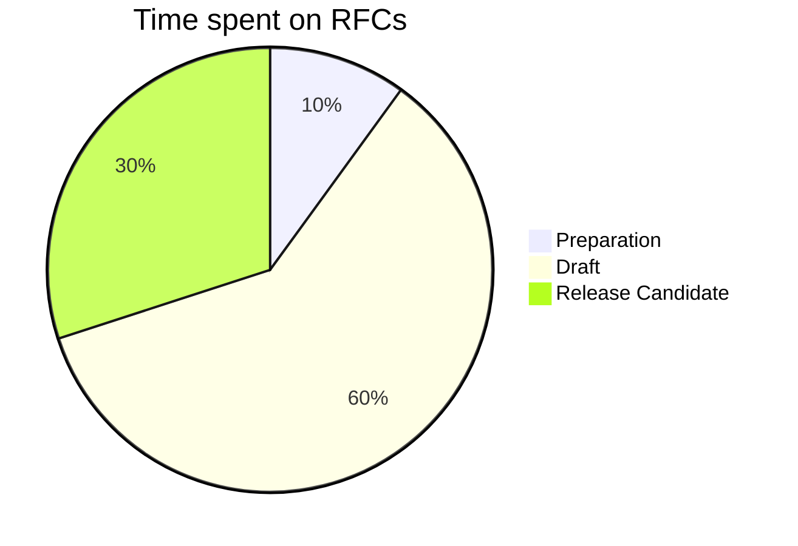

# RFC-0002: RFC on RFCs Tree

RFCs Tree is the metaphorical description and the hierarchical representation of the TM Request for Comments development plan that will be used as a baseline scenario to help monitoring the achievement of TM Horizon over the 10 years to come. 

While RFCS Tree is itself resulting from the progressive completion of RFCs through time, RFCS Tree also acts as a blueprint defining the incremental steps to the building of the Time Machine Horizon/Infrastructure. 

RFCs Tree then behaves as a body of law gathering the whole RFC documentation and production process, and as a progress indicator informing of the upgrade the of the Time Machine components in real time. 

As a macro architecture, RFCs Tree shapes dependencies between RFCs. It could be divided into micro thematic or productive arcs/sequences as each RFC is classified in one of the following categories: Framework, Infrastructure, Data, LTM. 

Singular RFCs are the basic units of RFCs Tree. The +70 initial RFCs are listed at the end of this document. This initial set is an indicative path to complete the TM Horizon and could be modified/edited if needed.
The tree-like structure -and the subsequent dependencies chains which connect singular RFC- guarantees that TM Horizon would be realised as each RFC edit/removal/addition will cause dynamic adjustements and reorganisations.

RFCs Tree will be consulted in real time on TM website.  

# RFCS Tree - RFCs list

-xxx
-xxx

## Hyperlinks

RFCs are released as PDF documents. While it is possible to set hyperlinks in Markdown that will also work in PDF documents it is advised to add the actual links in footnotes. This way they can be easily read.  Footnotes (similar to the one in the previous paragraph can be created by adding `[^footnote_name]` where the footnote is to be placed and `[^footnote_name]: Content of the footnote` at the end of this file. Only alphanumeric characters and underscores are allowed. Hyperlinks in footnotes should be added in angled brackets: `<http://example.com>`.

## Images

It is possible to include images. They should be added in an `images` folder directly next to the markdown document. In the text they are referenced like this: ``. The path is relative to the location of the Markdown file.

## Diagrams

In addition to pre-created images, it is also possible to add so-called *Mermaid*[^mermaid] diagrams and flowcharts to the document. This are two examples:

<!-- Footnote area: Please keep the list of footnotes sorted alphabetically to simplify managing them -->

[^daring_markdown]: <https://daringfireball.net/projects/markdown/basics>
[^mermaid]: <https://mermaid-js.github.io/mermaid/#/>
[^pandoc_markdown]: <https://pandoc.org/MANUAL.html#pandocs-markdown>
