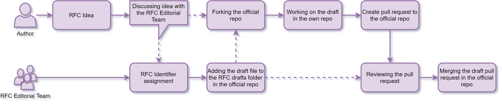
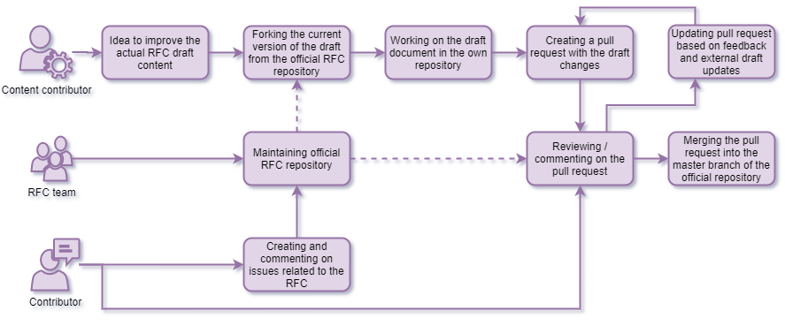
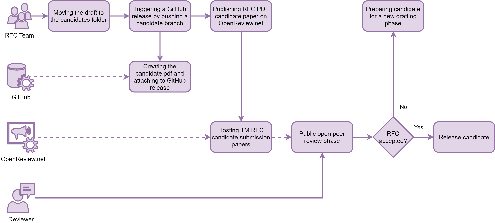
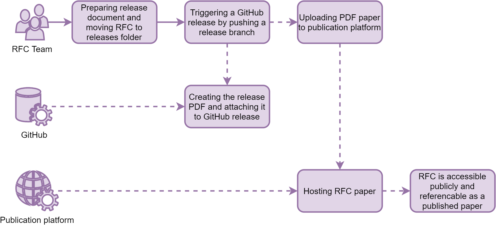

# Motivation

This Request for Comments describes the inner workings and technical details of the RFC platform. It aims to provide the technical framework for authorship, review, community contribution and publication for all future Time Machine Requests for Comments.

# Introduction

The Time Machine *Requests for Comments* (RFC) workflow is based on Git[^git_website], a tool initially designed to track changes to source code by multiple developers and GitHub[^github_about], currently the leading place to host open-source projects and to create and collaborate on software and many other kinds of projects. The contribution and review process used by RFCs builds on the basic *forking* workflow that "is most often seen in public open source projects"[^bitbucket_forking]. This ensures that contributions will be tracked indefinitely, review decisions are documented correctly and it is possible to permanently access and reference obsolete versions of the RFC drafts.

The choice of this solution is motivated by the possibility of scaling the number of users and contributions in time. It is likely that releasing and updating RFCs will ultimately be like maintaining a large source code base.

In addition to the git-based workflow, TM RFCs will give people not familiar with Git and the related tools the possibility to participate in additional ways, for instance by reviewing the RFC candidates published as papers on the open peer review platform OpenReview.net.

# Definitions

Before describing the workflow in detail, this section gives an overview on the most important design decisions and distinct parts of the platform:

+ All technical and content-related aspects of the RFCs are managed by the RFC Editorial Team appointed by the Time Machine Organisation board.
+ RFCs can be proposed by either the RFC Editorial Team, authors appointed by the Time Machine Organization or any other interested public author. An author can be an individual person or a group of authors working together on a single RFC draft.
*Note*: When this document speaks of an author it means both individual and groups of authors.
+ Any accepted RFC proposal will be assigned an identifier by the RFC Editorial Team. Identifiers are based on the pattern `RFC-[number]`. The numbers contain leading zeros to pad them to be four digits long. An example is this RFC itself, called `RFC-0003`, pronounced as *RFC-three*.
+ RFCs are drafted in Markdown[^orig_markdown_syntax] -- more specifically, in the extended syntax used by Pandoc[^pandoc_markdown], a tool to convert texts between different file formats.
+ RFC documents are managed in Git and are hosted in a single repository on GitHub. Public contributions will be possible via issues, comments and pull requests. The RFC Editorial Team is responsible for the maintenance of the repository.
+ The drafting process takes place and is therefore documented on the `master` branch of the main RFC repository[^main_repo_url].
+ Content contributions to an RFC can be made by creating a fork[^github_forking] of the official RFC repository and submitting all modifications in the form of a GitHub Pull-Request[^github_pullrequest] containing the relevant changes to the RFC repository.
+ Documents in the RFC repository are prepared in directories and files named after the RFC number, for example `RFC-0003/RFC-0003.md`.
+ The lifecycle phases for an RFC are `draft`, `release candidate` and `release`.
+ Draft phases will be opened to the public for two weeks.
+ Review phases will last for four weeks.
+ Drafts are stored in the `files/drafts` folder, release candidates in the `files/candidates` and released RFCs in the `files/releases/` folder.
+ In addition to the documents in the RFC repository, candidates and releases will be converted into PDF files using the above-mentioned Pandoc. These PDF files will be amended with the time of conversion as well as a unique release number and stored in the form of a GitHub Release[^github_release] with the PDF files attached as release assets.
*Note*: It is to be expected that the automatic file preview for Markdown files on GitHub (and possibly in other tools as well) differs from the final PDF files as Pandoc enables advanced features like footnotes that are not used by GitHub and their preferred Markdown dialect.[^gfm]
+ Release candidates will be published and reviewed on OpenReview.net[^openreview_about].
+ Releases will be provided with a DOI and published on the open-access repository Zenodo[^zenodo].

# Workflow phases

This section describes the progression of the RFC from an initial idea to the final release as a citable PDF paper.

## Phase 1: Conception

Ideas for RFCs can come from both the RFC Editorial Team and public authors, both as individual or groups of authors working together. Potential authors with an idea for an RFC should contact the RFC Editorial Team to coordinate the initial conception and drafting process. After accepting an RFC idea, the RFC Editorial Team will assign an identifier and prepare the draft file from a standardised template in the official RFC repository in the `files/drafts/[RFC-id]/` folder.

Following this step, the draft author will create a new fork of the official repository or pull the latest changes into their pre-existing fork in their own GitHub account and start to work on the initial version of the RFC draft document.

After the initial drafting process is finished and the draft is ready to be shared with the public, the initial draft author will create a pull request from their private fork to the official repository containing their initial version of the draft.

The RFC Editorial Team will then conduct a brief internal review of the initial draft to ensure the formal correctness of the document. After this is concluded and necessary changes are made by the initial draft author in the scope of the original pull request, the pull request is merged in the master branch of the official repository and the public drafting phase will start.

## Phase 2: Public drafting

The drafting of an RFC is designed as a process that enables direct contributions by public participants as well as the official RFC Editorial Team in a similar manner. Over the course of a fixed timespan all contributors can work on improvements of the draft text and propose and review changes. The fork-and-pull-request-workflow on GitHub makes sure that each contribution is registered and stored in the official repository indefinitely.

The official drafting phase starts with the merging of the initial RFC draft by the RFC Editorial Team and extends over a period of two weeks. The main RFC Markdown document as well as accompanying files, for example images, are stored in the `files/drafts/[RFC-id]` folder for the duration of the drafting phase.

Persons interested in contributing to the text directly, either by additions or changes of the existing content, can create a new fork (that is a full copy) of the official repository or pull the current state of its master branch into their own pre-existing fork. They can then either use the inline editor on the GitHub website to change the content of the RFC document in their own forked repository or clone their repository to their computer and use the Markdown editor / Git client of their choice to work with the files.

Changes to the RFC draft can be submitted at any time during the drafting phase in the form of pull requests from the forked repository to the so-called upstream repository, that is the official RFC repository. This enables the RFC Editorial Team and other contributors to review the proposed changes, suggest editions or point out problems directly next to the provided version of the draft document.

All pull requests to the official RFC repository during the drafting phase can be reviewed by any contributor but to be accepted and to be merged, favourable reviews by at least three appointed reviewers will be necessary. These reviewers are appointed by the RFC Editorial Team based on the area of expertise the RFC falls into. After a pull request passes the review, it is accepted and will be merged by the RFC Editorial Team into the master branch of the RFC repository. This makes the merged version the most recent official version of the draft. Other pull requests open at the same time will automatically be compared to this new version and will have to be amended by the contributors if necessary to solve possible conflicts with the then-official version.

Another way for potential contributors not familiar with Markdown writing and the Git-based workflow to contribute are so-called GitHub Issues[^github_issues]. These are commonly used to give users the possibility to report software bugs to project developers and to track tasks to be done. In the TM RFCs issues can be created by any person that wants to just report a problem with the current version of the draft or to discuss specific topics or ideas related to the RFC. It is the responsibility of the RFC author to react to these issues and up to the the RFC Editorial Team to moderate the issues as necessary.

## Phase 3: Release candidate review

After the end of the drafting phase and after all open pull requests containing changes to the draft are either merged or rejected, the final version of the draft will be turned into the first release candidate by the RFC Editorial Team. If necessary, the TM Editorial Team in combination with the appointed reviewers can abort the RFC drafting process. Otherwise, the RFC Editorial Team will update the list of authors / contributors in the document and move the  folder the RFC and all accompanying documents are located in from `files/drafts` to `files/candidates`.

To trigger the automatic release of the candidate the RFC Editorial Team commits and pushes the draft-turned-candidate on a new branch[^github_branches] in the main repository. The branch name will follow the pattern `[RFC-id]_candidate_[version_number]`. The version number will be assigned by the RFC Editorial Team and will follow semantic versioning[^semver]. This step triggers an automatic process in GitHub that converts the Markdown document into a PDF RFC candidate document with integrated version and timestamp and publish it in the form of a GitHub release.

The PDF file created in this step will be uploaded by the RFC Editorial Team as a submission in the RFC section of the virtual venue "TimeMachine" on the open peer review platform OpenReview.net[^openreview_timemachine]. The submission will be open for four weeks during which users of OpenReview will have the possibility to use the integrated tools to review the candidate or comment on it. This step ensures a scientifically sound RFC release and enables possible reviewers to use the tools they are familiar with from other paper review processes.

During this time contributors are encouraged to participate on OpenReview. Discussions in GitHub issues are still possible but pull requests on release candidates will not be accepted.

Depending on the result of the release candidate review process, the RFC will either progress to the official release phase, return to another drafting and refinement phase or be cancelled altogether if necessary. If an additional drafting phase is necessary, the document will be moved back to `files/drafts` by the RFC Editorial Team and pull requests on the `master` branch will again be considered for merging.

## Phase 4: Official release

If an RFC candidate is accepted by the community during the review phase on OpenReview, it will be prepared for the official release by the RFC Editorial Team. Again, the list of contributors will be updated as necessary and the document folder will be moved to `files/releases`. This change will be pushed onto a new Git branch that follows the naming pattern `[RFC-id]_release_[version_number]`. Analogous to the candidate phase, the version number will be assigned by the RFC Editorial Team and will follow semantic versioning. This step will again trigger the conversion of the document in the form of a versioned and timestamped PDF document that will be published as an asset on a GitHub release.

The finalized release PDF will then be published as an official publication by the Time Machine on Zenodo.

## Phase 5: Updates at a later point

Due to the fact that the RFCs describe all aspect of the Time Machine, additions, amendmends or changes to existing RFCs can be necessary. In this case the RFC Editorial Team will move the RFC file from the `files/releases` folder back to the `files/drafts` folder and a new drafting phase can start based on an amended draft produced by the new draft authors. It will then again process through all the different phases as described above resulting in a new release version.

# Q&A

<!-- TODO -->

<!-- Footnote content. Only alphanumeric characters and underscores are allowed. Please keep alphabetical sorting -->

[^bitbucket_forking]: <https://www.atlassian.com/git/tutorials/comparing-workflows/forking-workflow>
[^gfm]: GitHub Flavored Markdown (*GFM*) <https://github.github.com/gfm/>
[^git_website]: <https://git-scm.com/>
[^github_about]: <https://github.com/about>
[^github_branches]: <https://help.github.com/en/github/collaborating-with-issues-and-pull-requests/about-branches>
[^github_forking]: <https://guides.github.com/activities/forking/>
[^github_issues]: <https://guides.github.com/features/issues/>
[^github_pullrequest]: <https://help.github.com/en/github/collaborating-with-issues-and-pull-requests/about-pull-requests>
[^github_release]: <https://help.github.com/en/github/administering-a-repository/about-releases>
[^main_repo_url]: <https://github.com/time-machine-project/requests-for-comments>
[^openreview_about]: <https://openreview.net/about>
[^openreview_timemachine]: <https://openreview.net/group?id=TimeMachine.eu/RFC>
[^orig_markdown_syntax]: <https://daringfireball.net/projects/Markdown/syntax>
[^pandoc_markdown]: <https://pandoc.org/MANUAL.html#pandocs-Markdown>
[^semver]: <https://semver.org/>
[^zenodo]: <https://zenodo.org/>
