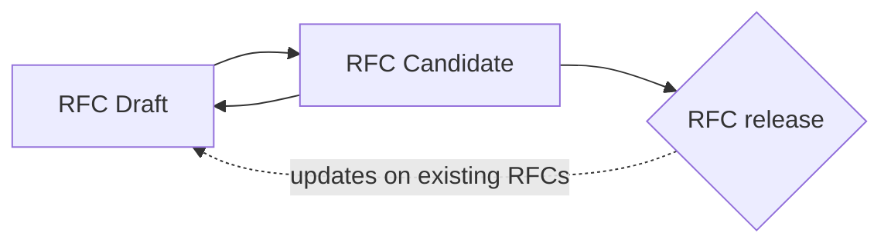
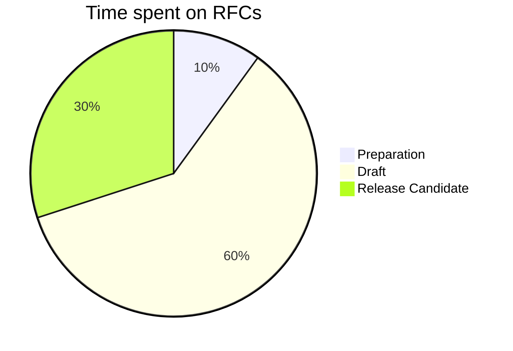

# RFC-0003: RFC on RFC Platform

This will be the new content.

# Markdown

It is allowed to use the whole range of Markdown features as well as everything supported by Pandoc out of the box. A good overview and introduction can be found in the Markdown specification itself[^daring_markdown] and the Pandoc user documentation[^pandoc_markdown].

## Hyperlinks

RFCs are released as PDF documents. While it is possible to set hyperlinks in Markdown that will also work in PDF documents it is advised to add the actual links in footnotes. This way they can be easily read.  Footnotes (similar to the one in the previous paragraph can be created by adding `[^footnote_name]` where the footnote is to be placed and `[^footnote_name]: Content of the footnote` at the end of this file. Only alphanumeric characters and underscores are allowed. Hyperlinks in footnotes should be added in angled brackets: `<http://example.com>`.

## Images

It is possible to include images. They should be added in an `images` folder directly next to the markdown document. In the text they are referenced like this: ``. The path is relative to the location of the Markdown file.

## Diagrams

In addition to pre-created images, it is also possible to add so-called *Mermaid*[^mermaid] diagrams and flowcharts to the document. This are two examples:

<!-- Footnote area: Please keep the list of footnotes sorted alphabetically to simplify managing them -->

[^daring_markdown]: <https://daringfireball.net/projects/markdown/basics>
[^mermaid]: <https://mermaid-js.github.io/mermaid/#/>
[^pandoc_markdown]: <https://pandoc.org/MANUAL.html#pandocs-markdown>
