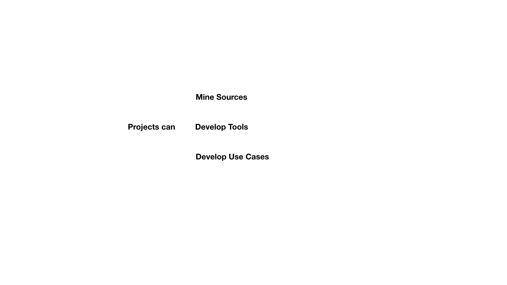

# RFC-0005: RFC on Local Time Machines

## Motivation

In order to build a planetary scale Time Machine, it is necessary to define an organic incremental strategy. To succeed, the Time Machine must enable to progressively anchor itself in local territories, directly bringing locally higher value to the  activities, favouring the creation of new projects to mine information about the past in surviving objects and documents. 

Local Time Machines can be defined as zones of higher density of activities of past reconstruction. This RFC defines the dynamics that permit to bootstrap Local Time Machines, facilitate onboarding of new projects, valorise the data extracted, facilitate the involvement of the local population, develop use cases for exploitation avenues and eventually find sustainable regime where **Big Data of the Past** are fruitfully exploited leading to a constant increase of such activities. 

## Approach

The general idea is that **Local Time Machines** do not have a hierarchical structure managed by a coordinator or leader, but represent an aggregation of different projects, which arose in different contexts and which have their own indipendent structure and governance, specific purposes, development context and method of financing. Consequently, **Local Time Machines** are area characterised by **Density of Operations**. There is no single coordination that aims to manage all the projects that have arisen in a specific area. All those involved in the various projects and activities, through their organisation charts, can in any case converge towards a community which will therefore have an autonomous logic of structuring and functioning that emerges locally. The projects involved can include project with national and internationl grants, institutional projects having internal funding, projects financed by local administrative institutions, projects hold by companies on cultural heritage benefiting of services and tools implemented by the **Time Machine Organisation** through the **Local Time Machines Infrastructure**, but also small scale projects lead by individuals.

The project-based horizontal structure has key advantages. 

- Standard process facilited easy onboarding facilates of new projects and members and ensure openness by-design

- Standard operations guaranty by design the desired level of compatibillity between processes and datasets. 

- Centralized repositories for projects, operations and data sets enable an constantly up-to-date map of activities in progress. 

-----

*Some key benefits in development of the Time Machine Organisation in designing an horizontal structure*
*The growth in membership including new members and new research activities. app*

*Manage a centralized system for cartographying  all the Local activities in progress and to directly monitor, on a centralized level, the evolution of the projects, compliance with ethical norms and standards, proposed and approved by the community.*

*Another fundamental requirement of the Time Machine Organisation is to have a precise cartography of all the Local activities in progress and to directly monitor, on a centralised level, the evolution of the projects, compliance with ethical norms and standards, proposed and approved by the community.*

-----

## Definition of Terms

###  Component 

A Component of the Time Machine is itselt a Machine in the sense of systems reacting in a predictable manner to input given an internal State. Each component can react or be acted upon through a defined set of Inputs / Operations. Some of these operations can internal, others can be external. 

####  Internal and External Operations of a Component 

Internal Operations change the internal structure or state of an Entity and therefore update its history. 

External Operations change characterises the usage of a Component, producing an external Output on the Bases of the current State of the Machine. 

####  History of a Component 

Sequence of consecutive states. 

## Definition of Core Components

###  4D Map

The **4D Map** is one of the central component of Time Machine. It plots both on-going projects and the dataset of these projects. This means that the  **4D Map**  is both the map where activities can be followed and the map that aggregates results. The density of the **4D Map** is not uniformed. In particular some zones may be modelled only in 3D, 2D and even 1D, as a list of included elements. The **4D Map** includes a layer of **GeoEntities** on which **Local Time Machines** can be anchored. The **4D Map** can be navigated using the several **4D interfaces**

Examples of Internal Operations 

- Addition of a new Local Time Machine on a **GeoEntity** of the **4D Map**.  
- Registration of an **Event** on the **4D Map**

###  4D Navigator Interfaces

The 4D interfaces can be application-based or web-based. They can be for desktop or mobile. By default, the mobile version may not feature more of the project editing tools. 

Examples of External Operations 

- Navigate in Space and see activities of **Local Time Machines**
- Navigate in Space and Time to see the State of the 4D reconstruction

###  Projects

Projects are usually conducted by institutions but can also be launched by individuals. Projects may be new or redocumentation of ancient projects. A project can be considered a component of the Time Machine, and therefore be characterised by a specific **History**. 

Projects can mine **Sources** and ingest their extracted data into the **Data Graph** using the **Local Time Machine Tools** and **Local Time Machine API** These Projects are associate with a **Zone of Coverage** that associated them with **Local Time Machines**, producing content for  **GeoEntitites**

Projects can also develop **Prototype Tools** that may become official Local Time Machine tools at a later stage. These tools are usually tested on local datasets and therefore associated with a a **Zone of Coverage**

Projects can also develop **Use Cases**, like example of interface to navigate the data, application in certain exploitaiton areas, etc. 

###  Zone of Coverage

The **Zone of Coverage** of a **Project** or a **Use Case** is defined as section of the **4D Map**.
The intersection of the **Zone of Coverage** and the **GeoEntities** covered by the Project. The **Zone of Coverage** may also definie a **Temporal Slice**. The **Zone of Coverage** can be defined using the **4D interfaces**. 

The **Zone of Coverage** can be defined searching a place in the list of **GeoEntities** and choising it on the map. This is the case of cities or entities already existing in the GeoEntities list. 

The **Zone of Coverage** can also defined with an inclusive criterion for example by selecting multiple entities already existing on the card. This is the case of many cities or more in general places already existing in the GeoEntities list. 

The **Zone of Coverage** may also correspond to a larger territory. In this case the system detects the coverage area as a set of all GeoEntities represented within this polygon. In the consultation mode, only the **GeoEntities**  included in the polygon of the project will be shown on the map.

*here figure of three cases*

###  GeoEntities

The **GeoEnttites** are a fixed list of entities that defines the list of potential **Local Time Machines**. The list is based on existing geographical entities (e.g. a list of Places documents in Open Street Map (OSM)) defines as standard Geographical Information System objects (points - lines - polygons). 

If some project covers an place not covered in the list of possible **GeoEntiites**, a request can me made for inclusion. 

The fact of mainting a curated list of **GeoEntities** permits to control the granulatiy of the **Local Time Machines** as the project develops.  In **Version A** it will be only possible to add new points to insert new  **Time Machine GeoEntities** in the case in which entities not yet existing in the list. In later versions would be important have an editing mode in which you can also draw different geometries (polygons-lines) for specifying shape of different entities. In later versions it will also be possible to make new **GeoEntities** even more granular within an already existing entity. This is the case of projects inserted in a city which, however, study only one particular point or a geographical 'subset' of objects present in the city.

###  Project Development Space

The **Project Development Space** is a space in the Time Machine Website that features an increasing number of tools to extract information from **Sources**, document **Use Cases**, etc. 

###  Local Time Machine

A **Local Time Machine** is defined as the activities and results of the **Projects** concerning a **GeoEntitity**

It is associated with a **Local Time Machine Activities** and **Local Time Machine Community**

The activities and results are presented in the **Local Time Machine Webspace**

The corresponding notions are defined in the following subsections. 

####  Local Time Machine Operations

The **Local Time Machine Operations** are the list of basic operations produced by **Projects** and concerning particular **GeoEntitites**. They appear as log of activies in the **Local Time Machines Webspace**. 

####  Local Time Machine Density of Operations

The **Local Time Machine Densitiy of Operations** characterises the amounty of activities going on in the **Local Time Machine**. It characterises both the activities that are going on inside **Projects** and for crowdsourcing activities

####  Local Time Machine Community

The **Local Time Machine Community** is the list of active users of a **Local Time Machine** 

These include 

* Users active in **Projects**
* Users active in crowdsourcing activities (e.g. transcription, correction, training, etc.) 

Depending on their level of activities, users may reach different status linked with particular privileges in terms of operations. These status are organised taking inspiration from the Wikipedia systems of priviliege (e.g. administrator, stewards, etc.)

By default, the active users may get updated about annoucement concerrning **Local Time Machine Activities**

#### Local Time Machine Webspace 

The **Local Time Webspace** features the information of all the **Projects** linked with the **GeoEntities** corresponding to the **Local Time Machines**

#### Local Time Machine Visual Plan

Automatically generated represenation of a spatiotemporal focus of the different projecs participating to a **Local Time Machine**

## Phases of Development of the LTM Infrastructure 

###  Phase I : Development of the Project Development Environment and LTM Webspace

The first reslease should permit to following components, essentially meant for introducing the basic structure of the LTM infrastructure functioning. At this stage, the LTM Webspace essentily consists in a redocumentation of the existing. 

####  Basic Navigation Interface for the 4D Map

A first Interface to visualize and navigate in a simplified version of **4D Map** as 2D planteray scale visualization (early prototype of a **4D interface**). The first planteray-scale representation could be done using Open Street Map data. Each cities which corresponds to a **Local Time Machine** (i.e. each city which have a **Project** activitily working on it) would be highlighted. By clicking of corresponding city, the user access the **Local Time Machine WebSpace**. The interface should give access to the General Menu permitting to create a new project. 

####  Project Development Environment

The **Project Development Environment** includes basic tools for perfoming internal operations 

   1. Updating the Project Name and basic description
   2. Updating the the List of Institutions Involved
   3. Updating the list **GeoEntities** on which the **Project** operates (the first version of this list  is automatically generated by the selection on the **4Dmap** using the  **Zone of Coverage** )
   4. Updating of Project Spatiotemporal Data Focus. These information will be used for positionning the project in the **Local Time Machine Visual Plan**
   5. Annoucing activities to be displayed in the corresponding Local Time Machine Agendas. 

Each of the project operations, i.e. the project history, can be seen and edited in the project log. 

   
#### User Manager

The **User Manager** includes basic tools :

1. User Login system including Password recovery
2. User Profile manager including photos,  link to other users pages

#### Local Time Machine Webspace

The Local Time Machine Webspace features all the information available about a given Local Time Machine

1. The projects covering the corresponding **GeoEntity**
2. The Local Time Machine Visual Plan, a synthetic summary of the activity of the **Projects**
3. The Local Time Machine Agenda of past and forthcoming Events
4. The combined log of the operations of the **Projects**

###  Phase II : First Components and Search Engine

####  More Advance Navigation Interface for the 4D Map

Introduction of additional layers

1. Searchable Place name layer
2. Spherical Images
3. Cadastral Parcels

#### Operators and Tools

In the Phase II the first components are introduced. The components will include basic building blocks for processing data in the Projects. Components are divided into two sets 

1. **Operators** that can transform data based on parameters and that can be chained in a procedural manner. 
2. **Tools** that needs a user interface. Tools can be used to tune parameters or create new empty Operators. 

Operators are developped as library of function that can be chained in a procedural approach. They can be called in Python and used for instance in a Jupyter Notebook or a directly usable. In Phase III they will included in the **Project Development Environment**. 

#### Examples of Tools 

##### Importers 

1. IIIF Source Importer  (Import an existing IIIF source). An imported source is immedialy searchable in the Search Engine. 
2. Collection creator: Create a new Time Machine hosted IIIF source, includes ingestion of a whole directoy of images of limited size)
3. Geographical Layer Importer (e.g. Geojsn importer) 
4. Datatable importer (e.g. CSV)
4. Cadastral Parcels Importer
5. Cloud point Importer 
6. Spherical Image Importer
7. 3D Model Importer

##### Annotators

Examples of dedicated tools for annotating images and documents 

1. Image Annotator: Permit to annotate zone of images in IIIF collection by defining zones and associate them with Time Machine or Wikidata ID). This makes these elements immediatable searchage. 
2. Transcription tool: Permit to input structure data (from based) to the Data Graph. For each document a **Data Mask** can be  defined. 
3. Parcel Annotator : Edit the Parcel Layer of the **4D Map** using a document as input 
4. Point of View Annotator. Input a Power of View associated with an image in the **4D Map**
5. Place Name Annotator. Associated a segment of an image with a Place in Place Name layer of the **4D Map** 
6. Homologous Point Annotator : update the homologous point network 
7. Spherical Image Annotator

##### Aligners

1. Georeferencing tool : Permit to Georefence a map part of the IIIF source by clicking on a number of homolougous points. 
2. Photoalignment tools : Permits to connect a photo with a map and with other photos based on homologous points,. 

#### Search Engine

The annotated document are directly searchable in the first version of the Search Engine.

The results of a search Engine can be 

1. A IIIF document. Clicking lead to the Document page. 
2. An Image . Clicking lead to the Image page. 
3. A GeoEntity. Clicking lead to GeoEntity Page. 
4. A Named Entity: Person, Place, Organisation . Clicking lead to the specific page. 
5. A conceptual Class of Object,Work, etc. Clicking lead to the specific page. 
6. A Time Machine User. Clicking lead to the user page. 

###  Phase III : More Advanced tools and Image search Engine

In the Phase III, more advanced tools dedicafed to specific kinds of series are developed. 

1. Table annotator
2. Cadastare Parcer
3. Directories Parcer. 

The Image search factily is include in the general Search Engine. 

People and Place pages become more sophisticated as the Data Graph densifies. 

(SECOND TOOL could be GUI for modelling in a procedural way the pipelines)

####  More Advance Navigation Interface for the 4D Map

Introduction of additional navigation mode including 

1. 4D Cloud Point
2. 4D Vectors

###  Phase IV : More Advanced tools, Map Image search Engine

###  Phase V : Photogrammetric Search Engine

## Principles of Development

### Memory Store

Each document, artefact or building is a memory store, a kind of "hard-drive" from the past. The Tools for the Local Time Machine are extraction tools to redocument the content of these memory stores into the **Data Graph**. 

### Retrochronological order

The principle that consists of starting from the present and going back to the past, retroprogating through transfer the presicion of the present 

### Information Skeleton

The information sketelon should contains a complete divison of a place for a given year. 
This includes all the pathways and all the parcels. 

### Semi-completness

Achievement for  **Place** of a good coverage of the Information Skeleton 

### Transfer

Transfer of a structure of given year to the the year before assuming no change have occured. Linked with the principle of continuity. If transfer of a given **Place**  is not impossible, its means that an event occured. This event must be modeled in order to push the information backward. 

### Frontier year

Oldest date in the past for which the information skeleton of the **Place** is semi-complete. 

### Scouting Projects

Project beyond the Frontiers year

## Core Data Structure

### 4D Map

This section gives some early details of the 4D Map layer that would need to be extend in more developed RFCs. In addition to tradition GIS layers, the 4D map includes seveal specific All layers have a temporal dimension attached. 

#### GeoEntities Layer

Official GeoEntities that can become Local Time Machine

#### Points of View Layer

Perspective of Photograph of a Painting. Can be determined with nmore or less precision

1. A point
2. A point with a direction 
3. A fully 3D positioning 

The photogrammetric process permits to generate large number of images with 3D Points of View. 

#### Parcel Layer

2D Polygon with temporal extension tycally defined by an administrative source (e.g. Parcels of the Napoleonic Cadastter of 1808)

#### Place names Layer 

Directly searcheable place names. 

#### Spherical Image Layer 

Layer of omni-directional images 

#### 4D Cloud Point Layer 

Each cloud point has a 4D coordinate. 

#### 4D Vectorial Layer

 Vector, lines and polygons in 4D. 
 
 
### Homologous point network
 
Connecting images with one another through homogous point 

### Action

### Place

### People

### Object

### Name

## Examples of Processes

### Example : Museum creating a project

To enter and curate data in the **Data Graph**, a Museum will create a project, possibly jointly with other institutions, with a particular spatio-temporal anchoring objective. For simplicity of the explanation, let’s assume the collection to be ingested is already digitized. The steps are the following:

1- The Museum defines the approximate **Zone of Coverage** of the collection. This will defines the **Places** (and therefore the **Local Time Machines**) for which the data will be relevant. It can be updated later. 

2- The Museum enters the repository where the **Source** collection is, typically as a IIIF repository. If the Museum does not have an IIIF solution, a physical or virtual **Time Machine Box** can be used. The data will remain in the chosen repository unless the Museum wants to benefit from a long-term preservation service. 

3- Using the **Tools**, the project partners reposition the objects of the chosen collection in space and time (for instance annotating content of paintings or documenting the steps in the trajectory of the objects)

4- As all operations are logged in the **Time Machine Operation Graph**, a synchronisation tools is capable of informing of any conflict in the metadata inserted linked to other operations of the Time Machine (for instance due to an inference or a non compatible entree). On this basis, the Museum may or may not update its metadata or launch specific research initiatives to investigate further the conflicting data elements. 

This case is a simple one. More complex curation may occur.

### Example : Modeling of cities in 3D

1- Element lirbary

2- 

## Use Cases

## Services to LTM

### Digitisation Hubs

The **Digitisation Hubs** are an example of service that will be offered to Local Time Machines  for digitisation (e.g. scanning of documents, streets, 3D scanning). 

The **Digitisation Hubs** will enable to seamlessly aggregated new document and metadata into a **Data Graph**, with the appropriate standards in terms of resolution, file formats, and metadata during acquisition. Contractual aspects will be dealt with the Time Machine Standard Contracts. 

The Structure and detailed functioning of the Digitisation Hubs are planned to be developed first as an RFC specifying their structure then implemented as a Service operated by several operators. As planned in the RFC Tree and roadmaps, The RFC on Digitisation Hubs is planned on Y2 and their first implementation on Y3 and Y4. It will be established directly with actors that may become Service operators. 

What is anticipated are the following steps :

a) Declaration of the digitisation Services on timemachine.eu

b) Specification of its **Zone of Coverage**. The **Zone of Coverage** will determine the Local Time Machines in which the Services will be publicized. 

c) Precise definition of digitisation offers using only **Standard Metrics** in order to be able to determine the exact price of the operations 

d) Once the service are ready, direct transaction on the Timemachine.eu platform

This way of functioning should enable to create a well-functioning single European market for digitisation services connecting operators and costumers using agreed standards. 

### Long-term Preservation

Likewise, some operators may offer services for the long-term preservation of particular datasets (e.g. IIIF repository). This can for instance include DNA storage. 

