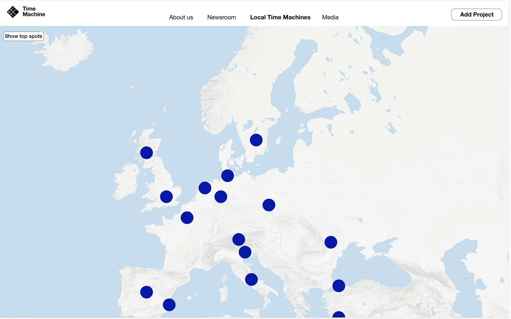

# RFC-0005: RFC on Local Time Machines

## Motivation

In order to build a planetary scale Time Machine, it is necessary to define an organic incremental strategy. To succeed, the Time Machine must enable to progressively anchor itself in local territories, directly bringing locally higher value to the  activities, favouring the creation of new projects to mine information about the past in surviving objects and documents. 

Local Time Machines can be defined as zones of higher density of activities of past reconstruction. This RFC defines the dynamics that permit to bootstrap Local Time Machines, facilitate onboarding of new projects, valorise the data extracted, facilitate the involvement of the local population, develop use cases for exploitation avenues and eventually find sustainable regime where **Big Data of the Past** are fruitfully exploited leading to a constant increase of such activities. 

This RFC defines an approach based on the standardisation of a core infrastructure and independent development of Apps. 

## Approach

### Openness By Design: Autonomy of Projects, Emergence of Local Time Machines

The first principle for the development of Local Time Machine is **Openness-by-design**. The general idea is that **Local Time Machines** do not have a hierarchical structure managed by a coordinator or leader, but represent an aggregation of different projects, which arose in different contexts and which have their own independent structure and governance, specific purposes, development context and method of financing. Consequently, **Local Time Machines** are areas characterised by **Density of Operations**. There is no single coordination that aims to manage all the **Projects** that have arisen in a specific area. All those involved in the various projects and activities, through their organisation charts, can in any case converge towards a community which will therefore have an autonomous logic of structuring and functioning that emerges locally. The projects involved can include project with national and international grants, institutional projects having internal funding, projects financed by local administrative institutions, projects hold by companies on cultural heritage benefiting of services and tools implemented by the **Time Machine Organisation** through the **Local Time Machines Infrastructure**, but also small-scale projects led by individuals.

The project-based horizontal structure has key advantages. 

- Standard processes facilitate easy on-boarding of new projects and members.They ensure openness by-design

- Standard operations and libraries of standard operators guaranty by design the desired level of compatibility between processes and datasets. 

- Centralised repositories for projects, operations and data sets enable a constantly up-to-date map of activities in progress. 

### Scalability by Design: Core Component, Apps, Code Library and Local Time Machines

To maximise growth of the Time Machine environment, the right balance must be found between part of the infrastructure under the control of the **Time Machine Organisation** and pieces of software independently developed. The Time Machine should be as distributed as possible but as centralized as necessary.

In the structure defined in this RFC, the **Time Machine Organisation** is responsible for the development of the **Core Infrastructure** which includes.

- The definition of the structure of the **Data Graph** and the creation of the interfaces to read and write it. 

- The curation of the **4D Map** including both the activities of the projects and the results of the reconstructions. 

- The curation of the **Project repository**, list of officially recognised projects transforming the **Data Graphs*  and **4D Map** and building Tools to read it and write it. 

- The curation of the **Code Library** regrouping key functions for processing Data in the Time Machine Environment. 

The **Apps** are pieces of software (in general built as part of official  **Projects** but not necessarily) that permits to experience and edit the information in the **Data Graph** and the **4D Map**. They can be grouped into families of **Apps** like the **Navigators** or the **Annotators**.

In this context, Local Time Machines defined as zones of higher density of activities, correspond to part of the **Data Graph** and **4D Maps** where **Project** activities are more intense. The level of intensity corresponding to the different labelling (**RFC on LTM Value Scale**, planned 2020) and corresponds to different modes of visualisation in the **Time Machine Website**

This principle of development permits a cost-effective strategy in which a variety of actors can be build tools and services around the activities of **Local Time Machines**

### Local Dynamics: Project Zone of Coverage and Local Time Machine Municipalities

**Local Time Machines** focus on **Municipalities**, i.e. zone of territories dividing the surface of earth on administratively non-ambiguous zones. The list of **Municipalities** is therefore the potential Local Time Machine is fixed and predetermined. It fixes the granularity of the **Local Time Machines**. 

**Projects** focus on a **Zone of Coverage** corresponding to one of several **GeoEntities**. The list of  based on existing geographical entities (e.g. a list of Places documents in Open Street Map (OSM)) defines as standard Geographical Information System objects (points - lines - polygons). Some **GeoEntities** can include **Municipalities** or be included in **Municipalities**. In both cases, the **Project** will be featured in the corresponding **Local Time Machines**.

## Core Components related to Local Time Machines

###  Data Graph

The **Data Graph** is the central component of the Time Machine, containing all the information modelled in the Time Machine. The graph is constructed both manually using editing **Apps** and automatically through the processing of the **Digital Content Processor** (3 RFCs planned in 2021). The **Data Graph** is intrinsically composed of two subparts. 

- The bright (actual) graph composed  of information that has been manually mapped and integrated with other large database
- The  dark (virtual) graph composed of information extracted automatically from (massive)  documentation which has been used so far apart as individual historic  items. 

**Apps** permit visualise and edit the **Data Graph**, thus performing Internal (e.g. inclusion of Nodes and Links) and External Operations (e.g. Visualisation).  As any **Component** of the Time Machine, the **Data Graph** is fully constructed in a procedural way, entirely defined by a sequence of operations.  

The first definition of the Data Graph is established by the **RFC on Time Machine Data Graph** (planned 2021, RFC2)

###  4D Map

The **4D Map** is a second central component of Time Machine. It plots both ongoing projects and the dataset of these projects. This means that the  **4D Map**  is both the map where activities can be followed and the map aggregating results. The density of the **4D Map** is not uniformed. In particular some zones may be modelled only in 3D, 2D and even 1D, as a list of included elements. The **4D Map** includes a layer of **Municipalities** on which **Local Time Machines** can be anchored. The **4D Map** can be navigated using the several **4D interfaces**

The Time Machine Website and **App** can perform specific internal operations like : 

- Addition of a new Local Time Machine on a **Municipality** of the **4D Map**.  
- Registration of an **Event** on the **4D Map**

**Apps** can also feature 4D interfaces, application-based or web-based, that permit to perform external operations like :

- Navigate in Space and see activities of **Local Time Machines**
- Navigate in Space and Time to see the State of the 4D reconstruction

The **4D Map** has a series of standard Layers that are fully defined in a dedicated RFC  (**Not currently planned in RFC2**)

1. The **Municipalities** segmentation that defines the granularity of the **Local Time Machines**
2. The **Points of View** Layer that corresponds to the perspectives of photographs or paintings. 
3. The **Parcel Layer** :  2D polygon with temporal extension typically defined by an administrative source (e.g. Parcels of the Napoleonic Cadastter of 1808). Each parcel has a unique ID in the Time Machine system.
4. The **Place names** Layer
5. The **Spherical Image** Layer 
6. The **Cloud Point** Layer
7. The **4D Vectorial** Layer
8. The **Homologous Point Network**, connecting images with one another through homogous point 

In the meantime, a simplified version of the **4D Map** is used : The **Local Time Machines Map**

###  Code Library

The **Code Library** is a library accessible in Python (and possibly later other languages) regrouping key **Operators** function for processing Data in the Time Machine Environment. 

###  Projects Repository

The **Projects Repository** monitors all the active projects of the Time Machine. **Projects** are usually conducted by institutions but can also be launched by individuals. Projects may be new or documentation of ancient projects. 

- Projects can mine **Sources** and ingest their extracted data into the **Data Graph**. These **Projects** are associated with a **Zone of Coverage** that associated them with **Local Time Machines**, producing content for  **GeoEntitites**. Projects may also produce intermediary datasets that can be downloaded even if they are not yet integrated in the **Data Graph**

- Projects can also develop **Apps** that interact with the **4D Map** and the **Data Graph**. 

- Projects can contribute to the **Code Library** by working on the GitHub repository of the Time Machine to produce new **Operators**

These different objectives are non-exclusive from one another. 

The **Project Development Space** is a space in the Time Machine Website that features the **Apps** relevant to develop the **Projects**. 

###  Time Machine Community

All users registered in the Time Machine Website. Each user Time Machine ID can be used to login in third parties **Apps**,  depending on their level of activity, users may reach different status linked with particular privileges in terms of operations. These statuses are organised taking inspiration from the Wikipedia systems of privileges (e.g. Administrator, Stewards, etc.).

##  Characteristics of Local Time Machines

A **Local Time Machine** is defined as the activities and results of the **Projects** concerning a **Municipality**

- The **Local Time Webspace** features the information of all the **Projects** linked with the **Municipality** corresponding to the **Local Time Machine**

- The **Local Time Machine Visual Plan** is an automatically generated representation of a spatiotemporal focus of the different projects participating to a **Local Time Machine**

- The **Local Time Machine Datasets** are extracted datasets that can be freely downloaded, even if they are not yet integrated with the global **Data Graph**

- The **Local Time Machine Operations** are the list of basic operations produced by **Projects** and concerning the **Municipality**. They appear as a log of activities in the **Local Time Machines Webspace**.  The **Local Time Machine Density of Operations** characterises the number of activities going on in the **Local Time Machine**. It characterises both the activities that are going on inside **Projects** and for Citizen Scientist activities. Standards values of activities define a scale to represent Local Time Machine (**RFC on LTM Value Scale**, planned 2020)

- The **Local Time Machine Community** is the list of active users of a **Local Time Machine** . These include users active in **Projects** and users active in crowdsourcing activities (e.g. transcription, correction, training, etc.). By default, the active users may get updated about announcement concerning **Local Time Machine Activities**

## First Phases of Development

###  Phase I : Development of the Project Environment and LTM Webspace

The first release develops the following components, essentially meant for introducing the basic structure of the LTM infrastructure functioning. At this stage, the LTM Webspace essentially consists in the documentation of the existing. 

####  Local Time Machines Map

A first interface to visualise and navigate in a simplified version of **4D Map** as a 2D visualisation. The first planetary-scale representation could be done using Open Street Map data. Each city which corresponds to a **Local Time Machine** (i.e. each city which has a **Project** actively working on it) would be highlighted. By clicking of corresponding city, the user access the **Local Time Machine WebSpace**. The interface should give access to the General Menu permitting to create a new project. 

Various versions of the **Local Time Machines Map** could be envisioned. 

Version 1 :  A zoom features permits to focus on the most active **Local Time Machines**

Version 2 : Simple dots are showing the Local Time Machines on the map.

   
#### Local Time Machine Webspace

The Local Time Machine Webspace features all the information available about a given Local Time Machine

1. The **Projects** covering the corresponding **GeoEntity**
2. The **Local Time Machine Visual Plan**, a synthetic summary of the activity of the **Projects**
3. The **Local Time Machine Agenda** of past and forthcoming Events
4. The combined log of the operations of the **Projects**
5. The **Local Time Machine Partners**, i.e list of institutions participating in at least one projects linked with the **Local Time Machine**

Wireframes of Local Time Machine Webspace incuding **Local Time Machine Visual Plan**, **Local Time Machine Datasets**, **Projects** associated with the **Local Time Machine**, the **Local Time Machine Agenda**, the news section covering the combined log of the **Projects** and the **Local Time Machine Partners**.

####  Project Environment

The **Project Environment** includes basic tools for performing Internal Operations on **Projects**

   1. Updating the Project Name and basic description
   2. Updating the List of institutions involved
   3. Updating the list **Municipalities** on which the **Project** operates (the first version of this list  is automatically generated by the selection on the **Local Time Machines Map** using the  **Zone of Coverage** )
   4. Updating of Project Spatiotemporal Data Focus. This information will be used for positioning the project in the **Local Time Machine Visual Plan**
   5. Annoucing activities to be displayed in the corresponding Local Time Machine Agendas. 

Each of the project operations, i.e. the project history, can be seen and edited in the Project log. Projects operations include : Publication of Datasets, Scientific Publications, Press Article, Addition of new Partner, etc. 

Wireframes of Project Page incuding link with external pages, datasets, contact person. related events, related news and associated institutions

When a new project is created, the user follows in a script to enter all the necessary information.

In the first Phase, the **Project Environment** will only enable the creation of projects whose primary goal is mining data from sources. The on-boarding process includes the following 5 steps : Name and Period, Geographic Coverage, Description, Public Data and Review/Publish

Step 1: Entering Project Name and Period : 

Step 2: Adding a Location from the list of **GeoEntities** . The **Zone of Coverage** of the **GeoEntity** may correspond directly to a **Municipality**, may include **Municipalities** or may be a sub-part of a **Municipality**. 

Step 2: Alternatively, one can draw a **Zone of Coverage** to select a list of **Municipalities** : 

Step 2: Editing the list of  **Municipalities*  associated with the **Project**

Step 3 : Entering Description :

Step 4: Entering Public Data : 

Step 4: Institution Picker :

Step 5 :Project Review :

All these parameters can also be edited afterwards from the **Project Environment** Menus.

#### User Manager

The **User Manager** includes basic tools :

1. User Login system including Password recovery
2. User Profile manager including photos,  link to other users' pages

###  Phase II : Development of the App and Code Library Environment

In the Phase II creates the environment for the development of the first Apps and the Code Library.

The **Code Library** is a joint effort to create Operators (function) that can transform data based on parameters and that can be chained in a procedural manner. They can be called in Python and used for instance in a Jupyter Notebook. 

The **Apps** are dedicated environment with user interfaces to interact with the **Data Graph** and the **4D Map**. Some **Apps** may use Operators of the **Code Library**

The **Project Environment** is extended to include projects creating **Apps** and operators for the **Code Library**.

#### Examples of Apps 

##### Navigators 

Navigators are the equivalent of Browsers on the World Wide Web. They interpret the **Data Graph** and the **4D Map** to create different processes for exploration. Various typologies of **Navigators can be designed : 

1. Search Engines (including Visual Search Engines). A generic Search Engine can search the **Data Graph** globally giving results for  IIIF documents,  images, GeoEntities, Named Entities (Person, Place, Organisation, etc.), Conceptual Class of Object, and potentially Time Machine Users.
2. Collection Browsers
3. 4D Browser (web-based or application-based for better performances)
4. Data Graph Inspector / Editor
5. Pattern finder / navigators 
6. Genealogical Explorer

##### Importers 

Importers permit to link existing datasets to the **Data Graph**

1. IIIF Source Importer  (Import an existing IIIF source). An imported source is immediately searchable in the Search Engine. 
2. Collection creator: Create a new Time Machine hosted IIIF source, includes ingestion of a whole directory of images of limited size)
3. Geographical Layer Importer (e.g. Geojsn importer) 
4. Datatable importer (e.g. CSV)
4. Cadastral Parcels Importer
5. Cloud point Importer 
6. Spherical Image Importer
7. 3D Model Importer

##### Annotators

Annotators are dedicated tools for annotating images and documents 

1. Image Annotator: Permit to annotate zone of images in IIIF collection by defining zones and associate them with Time Machine or Wikidata ID). This makes these elements immediately searchage. 
2. Transcription tool: Permit to input structure data (from based) to the Data Graph. For each document a **Data Mask** can be  defined. 
3. Parcel Annotator : Edit the Parcel Layer of the **4D Map** using a document as input 
4. Point of View Annotator. Input a Point of View associated with an image in the **4D Map**
5. Place Name Annotator. Associated a segment of an image with a Place in Place Name layer of the **4D Map** 
6. Homologous Point Annotator : update the homologous point network 
7. Spherical Image Annotator
8. Table Annotator
9. Parsers dedicated to specific document structure (Cadaster, Directories)

##### Aligners

1. Georeferencing tool : Permit to Georefence a map part of the IIIF source by clicking on a number of **Homologous Points** 
2. Photoalignment tools : Permits to connect a photo with a map and with other photos based on **Homologous Points**. 

##### Conflict Detectors

**Conflict Detectors** detect incoherence in the **Data Graph** and help users solve them. 

##### Digitisation and Storage Services

Apps can also offer specific services like digitisation or storage in direct link with the **Data Graph** and the **4D Map**

#### Examples of Operators from the Code Library

##### Segmenters

**Segmenters** can be used for

1. Objects and Persons in images
2. Parcels in Cadastral Maps
3. Document Layout analysis 
4. 3D Object segmentation. Using the **homologous point network** inside the **Data Graph**, some 2D to 3D segmenter  uses 2D segmentation to segment 3D objects

##### Transcribers

Transcribers perform state of the art HTR transcription in document. 

## Examples of Scenarios and Services

### Museum creating a Project

To enter and curate data in the **Data Graph**, a museum will create a **Project**, possibly jointly with other institutions, with a particular spatio-temporal anchoring objectives. For simplicity of the explanation, let’s assume the collection to be ingested is already digitised. The steps are the following:

1. In the **Project Environment**, the Museum defines the approximate **Zone of Coverage** of the collection. This will defines the **Municipalities** (and therefore the **Local Time Machines**) for which the data will be relevant. It can be updated later. 

2. The Museum enters the repository where the **Source** collection is, typically as a IIIF repository. If the Museum does not have an IIIF solution, a physical or virtual **Time Machine Box** can be used. This is an example of **App** adapted to the **Data Graph**. The data will remain in the chosen repository unless the Museum wants to benefit from a long-term preservation service. 

3. Using dedicated **Apps**, like **Annotators**, the project partners reposition the objects of the chosen collection in space and time (for instance annotating content of paintings or documenting the steps in the trajectory of the objects)

4. A **Conflict Detector** tool (another specific **App**)  is capable of informing of any conflict in the metadata inserted linked to other operations of the Time Machine (for instance due to an inference or a non-compatible entree). On this basis, the Museum may or may not update its metadata or launch specific research initiatives to investigate further the conflicting data elements. 

This case is a simple one. More complex curation may occur.

### Digitisation Hubs

The **Digitisation Hubs** are an example of services that will be offered to Local Time Machines  for digitisation (e.g. scanning of documents, streets, 3D scanning). 

The **Digitisation Hubs** will enable to seamlessly aggregated new document and metadata into a **Data Graph**, with the appropriate standards in terms of resolution, file formats, and metadata during acquisition. Contractual aspects will be dealt with the Time Machine Standard Contracts. 

The Structure and detailed functioning of the Digitisation Hubs are planned to be developed first as an RFC specifying their structure then implemented as a Service operated by several operators. As planned in the RFC Tree and roadmaps, the RFC on Digitisation Hubs is planned in 2021. It will be established directly with actors that may become Service operators. 

What is anticipated are the following steps :

1. Creation of a **Project** with of the digitisation Services on timemachine.eu

2.  Specification of its **Zone of Coverage**. The **Zone of Coverage** will determine the Local Time Machines in which the services will be publicised. 

3.  Precise definition of digitisation offers using only **Standard Metrics** in order to be able to determine the exact price of the operations. 

4.  Once the service are ready, creation of an **App** for offering the service. 

This way of functioning should enable to create a well-functioning single European market for digitisation services connecting operators and customers using agreed standards. 

### Long-term Preservation

Likewise, some partners may offer services for the long-term preservation of particular datasets (e.g. IIIF repository). This can for instance include DNA storage. 

## Subsequent Development Phases

The subsequent development phases are not detailed in this RFC but will be in future ones. 

###  Phase III : Development of the Franchise Model

In Phase III, the process for consolidating Local Time Machine activities in the **Municipality** itself is developed. This phase is described in the corresponding RFC : 

- RFC on Franchise System  (planned 2023)

###  Phase IV : Development of the Mirror World Environment 

This phase will be developed in the corresponding RFC : 

- RFC on Mirror World Prototyping (planned 2025)
- RFC on Mirror World Extension Strategy (planned 2026) 
- RFC on Mirror World Technical Standards  (planned 2026) 
- RFC on Virtual/Augmented Reality and Discovery  (planned 2026) 
- RFC on 4D Mirror World  (planned 2026) 
- RFC on Large Scale Mirror World (planned 2027)

## Coordination, Training and Local Dynamics

### Time Machine Academies

The goal of the **Time Machine Academies** is to help to global coordination in the development of **Apps** and the trainig of their use. 

Examples of Communities :

- Developers (Academic and SMEs)
- GLAM professionals 
- Scholars
- Stakeholders of specific Exploitation Avenues (e.g. Tourism, Creative Industries)

The details of the Time Machine Academy Process is developed in a separate RFC.

### Local Time Machine Events

Processes for organising local time machine event will also be discussed in a separated RFC

## Questions and Answers

### Can I create a Local Time Machine ?

Not directly. But by creating a project that works on a particular **GeoEntity**, I can start the development of the corresponding **Local Time Machine**.

### Can I edit a Local Time Machine ?

Not directly. But the **Local Time Machine** webspace is updated as information about projects are updated. 

### If my project studies a large object like Hadrian's Wall in which Local Time Machine will it be included?

It will be included on all the Local Time Machine focused on **Municipalities** that include a part of of the Hadrian's Wall. 

### I am part of an important institution of a City, how can my institution take part in the City Local Time Machine ?

By starting or redocumenting a project focusing on a **GeoEntitiy** that is part of the **Municipality**

### Can my project name be called (Name of City) Time Machine ?

A priori, no. Only Local Time Machines are called Time Machines. 

### My institution would like to participate to Local Time Machine but we are not located in the city. What can we do ?

This is not a problem. The institution must participate to a project focusing on a **GeoEntitiy** that is part of the **Municipality**

## New RFC to be included in the RFCs Tree

- **RFC on 4D Map**
- **RFC on Apps**
- **RFC on Operators**
- **RFC on Time Machine Academy** and **RFC on Local Time Machine Events** (Maybe redundant with **RFC on Training**, planned 2020)

