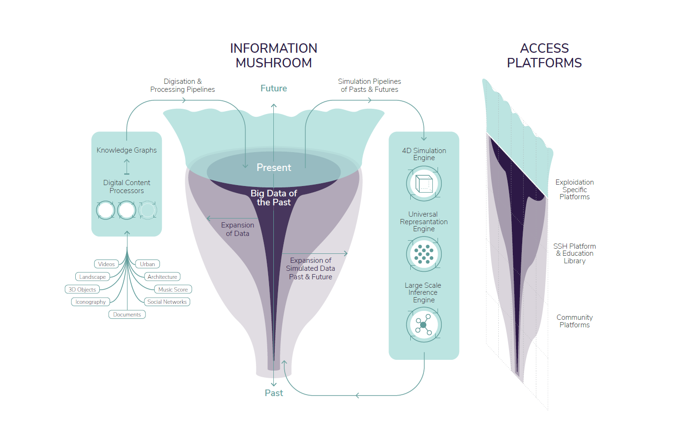

---
# Don't change this header section
title: "RFC on Technical Charter"
subtitle: "Time Machine RFC-0006"
author:
  - Juha Henriksson
header-includes:
  - \usepackage{fancyhdr}
  - \pagestyle{fancy}
  - \fancyhead[R]{}
  - \fancyfoot[L]{-release-version-}
output: pdf_document
---

# Motivation

The purpose of the Technical Charter is to describe Time Machine's structure at a general level and to provide a framework to which all Time Machine functions and services are related.

When implementing Time Machine's functions and services, it is encouraged to use of universal and open interfaces and references that do not require central coordination.

Time Machine's technical implementation and all functions and services related to the whole should be in accordance with Time Machine's visions, missions and values (**RFC-0007**).

# Fundamental Ideas

The Time Machine processing infrastructure will be composed of a digital content processor and three simulation engines:
- 4D Simulator that manages a continuous spatiotemporal simulation of all possible pasts and futures that are compatible with the data.
- Universal Representation Engine that manages the multidimensional representation space resulting from the integration of extremely diverse types of digital cultural artefacts (text, images, videos, 3D).
- Large-Scale Inference Engine that will shape and assess the coherence of 4D simulations based on human-understandable concepts and constraints.

Figure 1: Time Machine Digital Content Processor and the three simulation engines.

# Digitisation Infrastructure

The Time Machine digitisation infrastructure will be composed of a network of digitisation hubs and will be organised on a European scale. A peer-to-peer platform will be in charge of managing and optimising digitisation strategies at European level and will also be tasked with the development of generic solutions for archiving, directly documenting the digitisation processes and swiftly putting the digitised documents online.

# Local Time Machines

Time Machine Network is organised as a large number of Local Time Machines (LTMs), defined in **RFC-0005**. Each LTM is anchored in the space of a city, around which various partnerships can form, with the goal of transforming it into a zone with a higher density of “rebuilding the-past activities”.

# Linked RFCs

- Time Machine’s **Visions, missions and values** are defined in **RFC-0007**.

<!-- Footnote content. Only alphanumeric characters and underscores are allowed. Please keep alphabetical sorting -->

