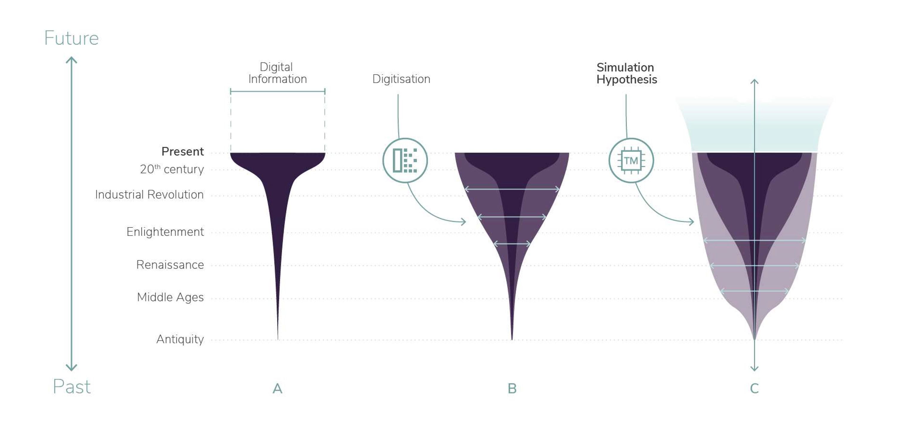
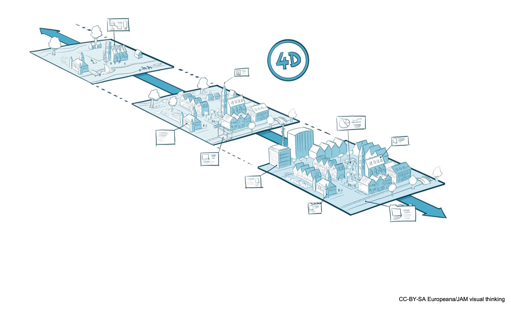
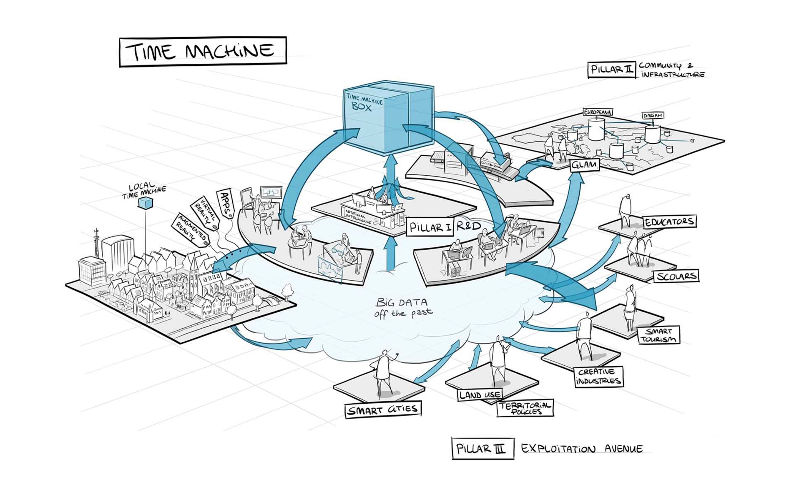

---
# Don't change this header section
title: "RFC on Vision, Mission and Values Charter "
subtitle: "Time Machine RFC-0007"
author:
  - Juha Henriksson
header-includes:
  - \usepackage{fancyhdr}
  - \pagestyle{fancy}
  - \fancyhead[R]{}
  - \fancyfoot[L]{-release-version-}
output: pdf_document
---

# Motivation

Globalisation, changing demographics and the dominant position of private social media platforms threaten Europe's cultural and democratic values and sense of belonging. Pluralistic and democratic dialogue in Europe has traditionally been facilitated by important intermediaries, such as cultural media and institutions acting as cornerstones of our shared values, principles, and memories. 

Today, the dialogue between different actors and the historical visions they embody is complicated by the rise of private digital platforms that have created a new space of opinion-leadership, as well as new forms of political expression and participation. Managed by proprietary algorithms, such platforms may prioritise popularity and personal agendas over historical and cultural data, opening the way to fake news. The resulting crisis of authority that affects journalism, academia and politics has led many people to distrust information received from these institutions.

These unprecedented transformations create a vital need for Europe to restore and to intensify engagement with its past as a means of facilitating an evidence-based dialogue between diverse historical memories, including their values and mutual interdependencies, building a common path across generations.

**Time Machine**[^tmo1] responds to this need by building, together with other communities and organisations, the required infrastructure, and an operational environment for developing the **Big Data of the Past** that will transform and enhance the role of history and culture across Europe. In turn, opening the way for scientific and technological progress to become a powerful ally to safeguarding European identity and democratic values, in line with Europe’s long-term development and democratic principles.

The duty of this **RFC-0007** is to protect the core of Time Machine and sustain its future. Becoming a Time Machine network member implies ratification of the Vision, Mission and Values Charter.

# Vision

Time Machine aims to develop the Big Data of the Past, creating a huge distributed digital information system mapping the European social, cultural, and geographical evolution across times. This large-scale digitisation and computing infrastructure will enable Europe to turn its long history, as well as its multilingualism and interculturalism, into a living social and economic resource.

Time Machine will have strong positive long-term effects on European cohesion, economy, and society, with concrete contributions to promoting critical thinking at all levels of decision making. Time Machine will strengthen the feeling of European identity, as well as boost scientific and technological competitiveness, entrepreneurship, and employment in knowledge-intensive and creative sectors across the European Union.

By pushing the frontiers of scientific research in Information and Communication Technologies (ICT) and in the Social Sciences and Humanities (SSH), Time Machine will strongly impact key sectors of European economy: ICT software, especially Augmented/Virtual Reality (AR/VR) applications, the creative industries, and tourism. Moreover, it will offer new perspectives in urban planning, land management and developing smart cities.

Time Machine will enable Social Sciences and Humanities to address bigger issues, allowing new interpretative models that can smoothly transition between the micro-analysis of single artefacts and the large-scale complex networks of European history and culture. Time Machine will be a driver of open science, as well as open (public) access to public resources.

The scientific vision behind the Time Machine is structured around the concept of Big Data of the Past. By plotting the amount of digital information available today against time, a funnel-shaped figure is expected to be seen. Information about the most recent years is abundant, and the curve shrinks rapidly as one moves back in time. Time Machine aims to enlarge the stem of this funnel. Firstly, by developing the technology and infrastructure needed to conduct massive digitisation and processing of cultural heritage resources. Secondly, this enlarged dataset will be the basis for simulating possible pasts to reach an unprecedented density of information: the Big Data of the Past. This enormous volume of data will also boost modelling capacity, making evidence-based predictions for the future possible.

Figure 1: Creating the Big Data of the Past (A) Current situation. (B) Extension based on digitisation and processing of new sources. (C) Extension based on simulation.

Immense amounts of historical documents, collections from museums and other geo-historical datasets – including the growing amount of ‘born digital’ heritage – will be converted into a distributed digital information system, associated with very powerful computing resources. This makes it possible to set the following goals:

- To digitally move through time as easily as we do through space. 
- To change the nature and scale of research methods in Social Sciences and Humanities. 
- To simulate possible futures and possible pasts.

Time Machine will give birth to a **mirror-world**, representing an up-to-date model of the world as it is, as it was and as it will be. Therefore, time will become a “palpable” fourth dimension. 

Time Machine will shape the mirror-world according to its democratic values and fundamental ethics such as open standards and interoperability. In the mirror world approach, each city will have a **3D digital twin**. This machine-readable version of the city will be annotated digitally, thus enabling the creation of a direct link between the digital information currently on the web or any social network platform to the digital copy of the city itself. 

As the city’s structure and shape continuously change over time, the city’s digital twin is inherently a **4D model**. In the Time Machine approach, each LTM strives to build a dense database of spatiotemporal information, laying the foundation of a 4D map.

Figure 2: 4D model of a city’s digital twin.

The Time Machine technical infrastructure is based on the RFC on Technical Charter (**RFC-0006**). To ensure the long-term sustainability, the governance and coordinating of Time Machine is conceived around the Time Machine Organisation (**RFC-0069**).

# Time Machine Pillars

The measures related to implementation of Time Machine are divided into four pillars:

- Pillar 1: Science and Technology for the Big Data of the Past
- Pillar 2: Time Machine Operation
- Pillar 3: Exploitation Avenues
- Pillar 4: Outreach and innovation

**Pillar 1** addresses the scientific and technological challenges in AI, Robotics, and ICT for developing the Big Data of the Past, while boosting these key enabling technologies in Europe. A modular, layered structure of interdependent modules is adopted in three directions:

- Data, enabling persistent digital access to millennia of linked historical data
- Computing, developing AI methods to explore, connect, and simulate historical information 
- Theory, focusing on SSH models of historical evidence that lead to new, plausible narratives
- Radically transforming the way in which SSH engages with and interfaces with the past

**Pillar 2** aims to design the operational infrastructure and the sustainable management model for creating and deploying Time Machine, with particular focus on:

- Building the Time Machine infrastructure for digitisation, processing, and simulation
- Drafting the community management systems
- Setting out the principles and processes for a network of **Local Time Machines** (RFC-0005)

**Pillar 3** will create innovation platforms in promising application areas, by bringing together developers and users to exploit scientific and technological achievements, therefore leveraging the cultural, societal, and economic impact of Time Machine. The main areas explored cover:

- Scholarship 
- Education
- Specific exploitation areas and uses in key economic sectors, including GLAM, Creative Industries, Smart Tourism, Smart Cities & Urban Planning, and Land Use and Territorial policies

**Pillar 4** will develop favourable framework conditions for outreach to all critical target groups and for guiding and facilitating the uptake of research outcomes. The main areas of intervention cover:

- Dissemination
- Policy, legal issues & ethics
- Knowledge transfer
- Exploitation support structures

Figure 3: The Time Machine overall concept and pillars 1–3.

# Principles and Values

The following principles and values are at the centre of Time Machine policies and practices. 
These principles and values are adhered in Time Machine efforts, platforms, vision, objectives, and relations with stakeholders.

- Time Machine is based on European values
- Time Machine strives for cohesion and bases on already extant initiatives
- Time Machine acts at global scale
- Time Machine is governed and led by the community
- Time Machine is sustainable
- Time Machine promotes openness, transparency, and inclusiveness
- Time Machine leads to a more competitive EU in the fields of AI and ICT
- Time Machine improves economic resilience of European cities and regions through entrepreneurship and innovation
- Time Machine creates new ways of working that drive greater societal relevance for Social Science & Humanities (SSH) 
- Time Machine creates the Big Data of the Past informing more effective policy making
- Time Machine will make EU citizens digitally literate critical thinkers that feel more connected to their past and assured of their identity in a pluralistic Europe
- Time Machine will provide tools to create data-driven stories and enable citizens and journalists to validate the trustworthiness of data and stories in the media	

# Linked RFCs

- The Time Machine infrastructure is based on the Technical Charter (**RFC-0006**)
- Local Time Machines are defined in **RFC-0005**
- The Time Machine Organisation (TMO) is defined in **RFC-0069**.

<!-- Footnote content. Only alphanumeric characters and underscores are allowed. Please keep alphabetical sorting -->

[^tmo1]: <https://www.timemachine.eu/>
