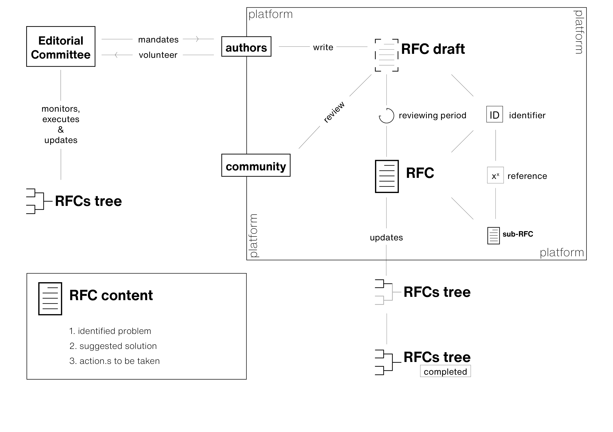

---
# Don't change this header section
title: "RFC on RFCs"
subtitle: "Time Machine RFC-0000"
author:
  - Frédéric Kaplan
  - Kevin Baumer
  - Mike Kestemont
  - Daniel Jeller
header-includes:
  - \usepackage{fancyhdr}
  - \pagestyle{fancy}
  - \fancyhead[R]{}
  - \fancyfoot[L]{-release-version-}
output: pdf_document
---

# Motivation

Reaching consensus on the technology options to pursue in a programme as large
as Time Machine is a complex issue. To ensure the open development and
evaluation of work, a process inspired by the Request for Comments (RFC) that
was used for the development of the Internet protocol[^ietf_rfc_791] is being
adapted to the needs of Time Machine. Time Machine Requests for Comments are
freely accessible publications, identified with a unique ID, that constitute the
main process for establishing rules, recommendations and core architectural
choices for Time Machine components.

# Approach

The Time Machine RFCs are based on the following principles:

1. Accessibility. **RFCs** are freely accessible, at no cost.
2. Openness. Anybody can write an **RFC**.
3. Identification. Each **RFC**, once published, has a unique ID and version
   number. It can nevertheless be revised over time as a living document, being
   republished with the same ID and a different version number.
4. Incrementalism. Each **RFC** should be useful in its own right and act as a
   building block for others. Each **RFC** must be intended as a contribution
   to, extension or revision of the Time Machine Infrastructure.
5. Standardisation. **RFCs** should aim to make use of standardised terms to
   improve the clarity level of its recommendation.
6. Scope. **RFCs** are designed contributions and implementation solutions for
   solving practical problems. **RFCs** are not research papers and may not
   necessarily contain experimental evidence. RFCs cover not only the technical
   infrastructure but the data standards, legal frameworks, and values and
   principles of Time Machine.
7. Self-defining process. As used for the development of the Internet, **RFCs**
   are the main process for establishing Time Machine Infrastructure and
   Processes and also the processes and roles for managing **RFCs** themselves.

# RFC Publication Process

**RFC Editor** organises the publication process of the RFCs, maintains the
consistency of the RFC System, appoints RFC teams to organise new RFCs and to
improve existing RFCs, keeps track of RFC versioning and ensures the timely and
regular publication of RFCs. The **RFC Editorial Committee** assists the RFC
Editor in the publication process. The duties of the **RFC Editor**, as well as
the organisation of the **RFC Editorial Committee**, are defined in
**RFC-0004**.

The publication process is the following :

1. The **RFC Editor** appoints authors to write the RFCs planned in the **RFC
   tree** (RFC-0002). Alternatively, authors may contact the **RFC Editor** to
   submit their candidature to write an RFC (planned in the **RFC tree** or
   not).
2. The authors produce an RFC draft which is reviewed by the RFC Editor, and if
   necessary, by the RFC Editorial Committee, for coherence with the rest of the
   RFC corpus, and then by a larger community. The RFC is revised and possibly
   sent for review again.
3. Once accepted by the **RFC Editorial Committee**, an RFC receives an official
   identifier and is officially published comparable to a peer-reviewed
   publication with proper scholarly credits assigned to the original author(s).
4. If necessary, the **RFC tree** is adapted to include the published RFC and
   any possible sub-RFCs planned during the writing of the RFC.

# RFC Format

The RFC Format and Guidelines are established iteratively by the **RFC Editor**
**RFC Editorial Committee**. The most-up-to-date version can be found in the
**RFC-0000**.

Current Format

1. Motivation section
2. Series of sections describing the approach and solution
3. Question and answers (Q&A) section
4. Linked RFCs section

# Question and Answers

## What are the main differences between Time Machine RFCs and Internet Society RFCs?

The Time Machine RFCs are being developed over 50 years after the RFCs that
shaped in the Internet. The main differences are the following:

1. Time Machine RFCs are exclusively used to describe motivated solutions and
   not general communication.
2. Time Machine RFCs can be revised and are redefined iteratively, whereas
   significant improvement on an Internet Society RFC leads to the creation of a
   new RFC.

# Linked RFCs

- The **RFC Tree** is kept up to date in **RFC-0002**.
- The details of the RFC platform are defined in the **RFC-0003**.
- The **RFC Editor** and the **RFC Editorial Committee** are defined in
  **RFC-0004**.

<!-- Footnote area: Please keep the list of footnotes sorted alphabetically to simplify managing them -->

[^ietf_rfc_791]: <https://tools.ietf.org/html/rfc791>
