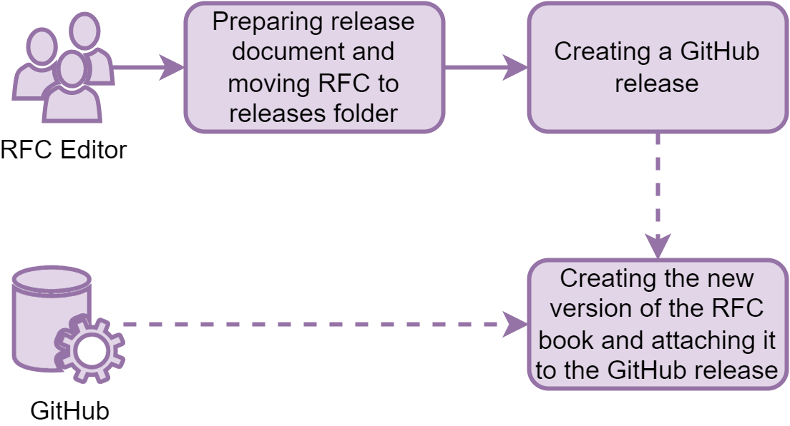

---
# Don't change this header section
title: "RFC on RFC Platform"
subtitle: "Time Machine RFC-0003"
author:
  - Daniel Jeller
  - Frédéric Kaplan
  - Kevin Baumer
header-includes:
  - \usepackage{fancyhdr}
  - \pagestyle{fancy}
  - \fancyhead[R]{}
  - \fancyfoot[L]{-release-version-}
output: pdf_document
---

# Motivation

This Request for Comments (RFC) describes the inner workings and technical
details of the RFC platform itself. It aims to provide the technical framework
for authorship, review, community contribution and publication of all future
Time Machine RFCs.

# Introduction

The Time Machine **Requests for Comments** (RFC) workflow is based on
Git[^git_website], a tool initially designed to track changes to source code by
multiple developers and GitHub[^github_about], currently the leading place to
host open-source projects and to create and collaborate on software and many
other kinds of projects. The contribution and review process used by RFCs builds
on the basic _forking_ workflow that "is most often seen in public open source
projects"[^bitbucket_forking]. This ensures that contributions will be tracked
indefinitely, review decisions are documented correctly and it is possible to
permanently access and reference older versions of the RFC drafts.

The choice of this solution is motivated by the possibility to scale the number
of users and contributions over time. It is likely that releasing and updating
RFCs will ultimately be akin to maintaining a large software codebase.

# Definitions

Before describing the workflow in detail, this section gives an overview on the
most important design decisions and distinct parts of the platform.

## RFC Editorial Committee and RFC Team

All strategic and aspects of the RFCs are managed by the **RFC Editorial
Committee** appointed by the Time Machine Organisation board, the technical
management, editorial work and support for RFC authors and other contributors is
done by the **RFC Team**.

## Authorship

An RFC author can be an individual person or a group of authors working together
on a single RFC draft. _Note_: This document doesn't differentiate between
individual and groups of authors when talking about _RFC authors_.

## New RFC proposal

RFCs can be proposed by either the RFC Editorial Committee, RFC authors
appointed by the Time Machine Organization or any other interested public
author. An up-to-date list of planned RFCs and their interconnection can be seen
in RFC-0002.

## Identifiers

Any accepted RFC proposal will be assigned an identifier by the RFC Team.
Identifiers are based on the pattern `RFC-[number]`. The numbers contain leading
zeros to pad them to be four digits long. An example is this RFC itself, called
`RFC-0003`, pronounced as _RFC-three_.

## Document format

RFCs are drafted in markdown[^orig_markdown_syntax] -- more specifically, in the
extended syntax used by Pandoc[^pandoc_markdown], a tool to convert texts
between different file formats.

_Note_: A short introduction into the most important features of markdown can be
found in the \*RFC-template document[^template]

## RFC content and contribution repository

RFC documents are managed in Git and are hosted in a single repository on
GitHub. The individual RFCs stored in directories and files named after the RFC
number, for example `RFC-0003/RFC-0003.md`. Accompanying files like images are
stored alongside the main RFC documents. Public contributions will be possible
via issues, comments and pull requests, the RFC Team is responsible for the
immediate interaction with the community as well as the maintenance of the
repository.

Content contributions to an RFC currently being drafted can be made by creating
a fork[^github_forking] of the official RFC repository and submitting all
modifications in the form of a GitHub Pull-Request[^github_pullrequest]
containing the relevant changes to the RFC repository.

_Note_: An author-pull-request is only allowed to contain changes to a single
RFC (main document and accompanying files), otherwise it will be rejected by the
RFC Team. Changes to multiple RFCs need to be submitted in separate RFCs.
Contributions outside an active drafting phase will also be rejected.

## Document life cycle

The life cycle phases for an RFC are `draft` and `release`. Draft phases will be
open to the public for an arbitrary amount of time during which the RFC is being
prepared by the authors and open to comments by the public. Drafts are stored in
the `files/drafts` folder, and released RFCs in the `files/releases/` folder of
the RFC repository.

## Publication

In addition to the markdown-documents in the RFC repository, drafts and releases
will be converted into PDF files using the above-mentioned Pandoc. These PDF
files will be amended with the time of conversion as well as a unique release
number, then stored as build artifacts[^github_job_details] in the GitHub
repository.

After significant releases and following a loose half-yearly schedule, all
drafts and releases will be published in a combined and timestamped PDF document
called the **RFC-book**. This PDF document is built automatically when a GitHub
release[^github_release] is created and attached to the GitHub release page.

_Note_: It is to be expected that the automatic file preview for markdown files
on GitHub (and possibly in other tools as well) will differ from the final PDF
files, as Pandoc, the tool used to create these files, enables advanced features
like footnotes which are not necessarily used by GitHub and their preferred
markdown dialect.[^gfm]

# Workflow phases

This section describes the progression of the RFC from an initial idea to its
final release in the RFC book.

## Phase 1: Conception

Ideas for RFCs can come from both the RFC Editorial Committee and public
authors, both as individual or groups of authors working together. Potential
authors with an idea for an RFC should contact the RFC Editorial Committee to
coordinate the initial conception and drafting process. After accepting an RFC
idea, the RFC Editorial Committee will assign an identifier and the RFC Team
will prepare the draft file from a standardised template in the official RFC
repository in the `files/drafts/[RFC-id]/` folder.

Following this step, the draft author can work on the document as they wish but
once they feel the RFC is in a submittable state they will create a pull request
with the draft text to the RFC repository or submit the text so the RFC Team can
do so on their behalf.

The RFC Team will then conduct a brief internal review of the initial draft to
ensure the formal correctness of the document. After this is concluded and
necessary changes are made by the initial draft author in the scope of the
original submission, the pull request is merged in the master branch of the
official repository and the public drafting phase will start.

## Phase 2: Public drafting and review

The drafting of an RFC is designed as a process that enables direct
contributions by public participants as well as the official RFC Editorial
Committee and Team in a similar manner. Over the course of a limited timespan
all contributors can work on improvements of the draft text or propose and
review changes. The fork-and-pull-request-workflow on GitHub makes sure that
each contribution is registered and stored in the official repository
indefinitely.

The official drafting and review phase begins with the merging of the initial
RFC draft by the RFC Team and extends over an arbitrary period of time depending
on the topic and scope of the RFC being drafted. The main RFC markdown document
as well as accompanying files, for example images, are stored in the
`files/drafts/[RFC-id]` folder for the duration of the drafting phase.

Persons interested in contributing to the text directly, either by additions or
changes to the existing content, can create a new fork (a full copy) of the
official repository or pull the current state of its master branch into their
own pre-existing fork. They can then either: use the inline editor on the GitHub
website to change the content of the RFC document in their own forked
repository, or clone their repository to their computer and use a markdown
editor / Git client of their choice to work with the files.

Changes to the RFC draft can be submitted at any time during the drafting phase
in the form of pull requests from the forked repository to the so-called
upstream repository, that is the official RFC repository. This enables the RFC
Editorial Committee, RFC Team and other contributors to review the proposed
changes, suggest editions or point out problems directly next to the provided
version of the draft document.

All pull requests to the official RFC repository during the drafting and review
phase can be reviewed and commented by any contributor but to be accepted and to
be merged the changes have to be accepted by the RFC Team and Editorial
Committee or reviewers appointed by the RFC Editorial Committee. After a pull
request with changes passes this review, it is accepted and will be merged by
the RFC Team into the master branch of the RFC repository. This makes the newly
merged version the new official version of the draft. Other open pull requests
will have to be updated by their creators to integrate the new changes into
their version if conflicts occur.

Merged pull requests will trigger a _GitHub Action_[^github_action] that
compiles the current version of all open draft documents and attaches them as a
ZIP file accessible in workflow job details[^github_job_details]. These preview
files are available for 90 days.

Another way for potential contributors not familiar with markdown writing and
the Git-based workflow to contribute are so-called GitHub
Issues[^github_issues]. These are commonly used to give users the possibility to
report software bugs to project developers and to track tasks to be done. In the
TM RFCs issues can be created by any person that wants to just report a problem
with the current version of the draft or to discuss specific topics or ideas
related to the RFC. New issues will be tagged by the RFC Team with the
identifier of the RFC they are directed at. It is the responsibility of the RFC
author to react to these issues and up to the RFC Team to moderate the issues as
necessary.

## Phase 3: Release

If an RFC draft is considered fit for release by the community and the RFC
Editorial Committee and reviewers after the drafting and review phase, the draft
file is updated to include all contributors and to conform to the other
formalities and is then moved from the `files/drafts` folder to `files/releases`
by the RFC Team. After merging this change into the master branch of the
repository, a new GitHub release[^github_release] will be created by the RFC
Team. This will trigger the creation of a new timestamped version of the RFC
book which will be attached to the release. This marks the formal release of the
newly finished RFC document.

# Updates at a later point

Due to the fact that the RFCs describe aspects of the Time Machine, additions,
amendments or changes to existing RFCs may be necessary. If this is the case,
the RFC Team will move the RFC file to be amended from the `files/releases`
folder back to the `files/drafts` folder and a new drafting phase can start. It
will then again process through all the different phases as described above
resulting in a new release version.

# Q&A

## Question: Do I need a GitHub account to contribute to an RFC?

Yes, you will need a GitHub account if you would like to contribute directly to
the text of an RFC, to discuss issues or to comment on pull requests. It serves
to make attributions of content and comments from individual persons possible
and to help to ensure scientific standards for the drafting and review process.

## Question: I have an idea for an RFC. What do I do?

Please contact the RFC Team at [rfc@timemachine.eu](mailto:rfc@timemachine.eu)
with your idea. They will assist you with the creation an initial draft version
of the idea, if it is deemed to be suitable and feasible.

## Question: I would like to fix some errors in an RFC draft. How do I do that?

The easiest way is for you to sign in to your GitHub account, create a fork of
the main RFC repository into your own account, fix the error in your forked
version of the document, commit it into your repository and open a pull request
outlining your changes to the main RFC repository. It will then be visible, can
be reviewed and then eventually merged into the main draft document if the
changes are accepted by the reviewers. If you need any help with this, feel free
to contact the RFC Team at [rfc@timemachine.eu](mailto:rfc@timemachine.eu).

## Question: I have worked on a draft document myself and would like to preview the final PDF document to see how it would look. How can I do this?

If you follow the official contribution process by forking the main RFC
repository, anything you push to the `master` branch in your own repository will
be automatically converted into a PDF document by triggering a GitHub action.
You can access the ZIP file with the compiled draft documents in the GitHub job
details page in the action section once you have enabled[^github_enable_actions]
the execution of actions in your repository.

## Question: How do I see which drafts are currently available for contributions?

You can see the current plan of work in the _README_[^github_repo_rfc_readme]
file of the main RFC repository.

<!-- TODO -->

<!-- Footnote content. Only alphanumeric characters and underscores are allowed. Please keep alphabetical sorting -->

[^bitbucket_forking]:
    <https://www.atlassian.com/git/tutorials/comparing-workflows/forking-workflow>

[^gfm]: GitHub Flavored markdown (_GFM_) <https://github.github.com/gfm/>
[^git_website]: <https://git-scm.com/>
[^github_about]: <https://github.com/about>
[^github_action]: <https://help.github.com/actions>
[^github_enable_actions]:
    <https://docs.github.com/en/repositories/managing-your-repositorys-settings-and-features/enabling-features-for-your-repository/managing-github-actions-settings-for-a-repository#allowing-specific-actions-to-run>

[^github_forking]: <https://guides.github.com/activities/forking/>
[^github_issues]: <https://guides.github.com/features/issues/>
[^github_job_details]:
    <https://help.github.com/en/actions/configuring-and-managing-workflows/persisting-workflow-data-using-artifacts#downloading-or-deleting-artifacts>

[^github_pullrequest]:
    <https://help.github.com/en/github/collaborating-with-issues-and-pull-requests/about-pull-requests>

[^github_release]:
    <https://help.github.com/en/github/administering-a-repository/about-releases>

[^github_repo_rfc_readme]:
    <https://github.com/time-machine-project/requests-for-comments/blob/master/README.md>

[^orig_markdown_syntax]: <https://daringfireball.net/projects/markdown/syntax>
[^pandoc_markdown]: <https://pandoc.org/MANUAL.html#pandocs-markdown>
[^template]:
    <https://github.com/time-machine-project/requests-for-comments/blob/master/files/template/RFC-template.md>
