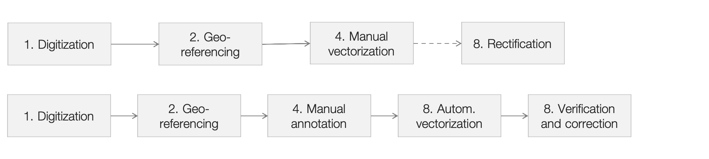

# Motivation

Cadastral maps are structured historical data representations consisting of a dual system of information. On the one hand, the map, in which urban and territorial elements are presented in a cartography that follows a deliberately standardized graphism. Each parcel element drawn on the map contains a unique identifier that can be alphanumeric. On the other hand, the cadastral registers that contain the alphanumeric identifier, and some specific attributes that were used to trace the owner of the parcel, the function of use, sometimes the annuity, the surface, and other qualitative and quantitative indicators. The richness of information in these sources makes them indispensable for the humanities, both for historical reconstruction, but also for specific heritage mediation initiatives. In addition, the geometric nature of cartography makes it easily compatible with the computational world. Geographers and historians often vectorize historical maps manually. The vectorization process consists of redrawing the geometric elements of the map (roads, parcel boundaries, buildings, etc.) one by one in a geographic information system (GIS). In a second step, attributes, such as parcel numbers, can be added to this digital representation of the cadastral map. This process eventually makes the map digitally intelligible and, more importantly, searchable. In the perspective of creating geohistorical databases that allow us both to visualize and retrieve historical information, the problem is therefore primarily one of vectorization.

The purpose of this RFC is to structure the approach to massive computational processing of certain tasks, typically vectorization, but also labeling with ad hoc attributes of the graphical elements that appear on the map, and correction of computational extraction in an open environment, potentially enhanced by collective collaboration. A coherent, generic and standardized pipeline, not set on a single use case, would allow to process large amounts of cadastral sheets accessible in European archives. Indeed, these sheets are often digitized (i.e. scanned) but rarely vectorized and therefore not digitally intelligible.

Cadastral maps in combination with the adjoined information in the registers, often provide the oldest and most detailed spatial and historic reference available for region’s in general. The shared paradigm provides potential for comparative research.

# Definition

In this chapter, we will attempt to define the cadastre in the context of the Time Machine Organization (TMO). First, we must point out that we will use the term cadastre by abuse of language in the sense of cadastral map. We will call pre-cadastres the textual cadastral registers that predominated before the appearance of the cadastral map. Proto-cadastres, however, are not the subject of this RFC. The definition of the cadastral object should allow to coordinate research and processing efforts and to develop common and generic solutions for the analysis, extraction and valorization of these documents. Thus, in the context of the Time Machine, by cadastre (or cadaster), we imply the following:
 
> **Cadastre** – A (set of) cartographic document(s), with or without an associated legend, established as a result of topographic surveys and administrative operations, describing the division into parcels and the state of land ownership of a geographical area.
 
The cadastres can take different forms, depending on the place, the cultural context and the epoch. The technical means of geographic surveying and geodesy have greatly evolved since the first adoption of triangulation, until the appearance of aerial photography. As a result, the level of geographic accuracy of the data differs significantly. Drawing have also impacted the accuracy of documents over time. Besides, the level of detail of the information varies from one document to another, as well as the nature of the information contained. For instance, some cadastres also include data on the land value or the land use, while others only describe the land ownership.

To facilitate exchange and communication among scholars, we highlight four types of cadastres frequently observed within the Time Machine community on which more specific development efforts can be conducted in a coordinated manner. We name these four families of documents without claiming onomastic accuracy, but purely indicatively.

## Proto-cadastre
This category includes a large number of primitive cadastral maps drawn up in general during the 18th century, which often have a limited spatial accuracy. The conventions of representation are not yet fixed, and these maps are characterized by a strong figurative diversity, often specific to the cartographer. In most cases, there is no separate legend because the information is annotated on the map itself.

## Austro-Napoleonic cadastre
From 1812 onwards, land mapping campaigns were launched throughout Europe on the model of the so-called *Napoleonic* cadastre. These maps covered the largest part of Western Europe, from Spain to the Netherlands, including Italy, the Austro-Hungarian Empire and the Confederation of the Rhine (Germany). The Napoleonic cadastre is thus one of the main historical sources of the 19th century in Europe and the hundreds of thousands of sheets that compose it are largely digitized (i.e. scanned). The Napoleonic cadastration campaign is famous for the unification of graphic codes. Buildings are thus generally represented in various shades of pink, or “carmine” [^1811_hennet]. The road network is most often white or beige, the water blue. The parcels are generally separated by a continuous line and the map is associated with a legend, by means of parcel numbers.

## Renovated and modern cadastre
Renovated cadastres are cadastres emerging in the second half of the 19th century. The renovated cadastres sometimes follow a Napoleonic cadastre, but not systematically. They adopt similar graphic codes, but often with more detail. The lines and colors are sharper and more uniform compared to the previous maps. The figurative grammar can be more complex, especially with regard to the separation of parcels, sometimes by portraying a complex system of boundary markers or walls. They usually have a structured legend table. Often, the impetus lies with the emergence of geodetic techniques.

# Workflow & typology of data

Cadastres can be subject to either manual or automatic vectorization procedures. As a major cultural heritage with a strong local implementation, the treatment of large geohistorical corpora can also resort to collaborative approaches or citizen science. As In addition, the purpose of the research projects may differ, not all projects follow the same workflow. However, certain steps are repeated in a large number of projects, both following manual and automatic approaches. The formalization of these steps and the description of the typologies can therefore maximize the interoperability of the data, and thus the sharing of resources.

1. **Digitized image**. Image of the cadastral sheet scanned in high resolution;
2. **Georeferenced image**. Image geographically referenced via homologous points;
3. **Manual vectorization**. Manually produced with GIS software or an annotator, these quality vector data are image-based and simply correspond to a redraw of the cadastral map in a digital format, most often following the IIIF-standard;
4. **Manual annotation**. Differing slightly from the previous ones in terms of production paradigms, these image-based data are suitable for training automatic vectorization algorithms;
5. **Automatic vectorization**. These data are created automatically using recent technologies based on machine learning and/or computer vision, and thanks to raster-to-vector algorithms;
6. **Verified and corrected automatic vectorization**. This data is derived from the correction and manual verification of automatically extracted data;
7. **Rectified vectorization**. These data can be obtained by modifying automatically extracted and then corrected data or from a completely manual vectorization. It is based on a geographic ground-truth alignment rather than on the cadastral image.

It is possible to skip some steps. For example, a completely manual project might simply consist of scanning the images (1), georeferencing and tiling them (2, 3), manually vectorizing them (3), and then directly rectifying the vector data on current satellite images (7). By definition, steps (3) and (4, 5, 6) are mutually exclusive. They correspond respectively to a manual or automatic processing pipeline.

## Phase 1: Image digitization

Map images should be scanned in sufficient resolution (min 300 dpi). Some documents may contain more than one map, for example a thumbnail of the overall plan or a close-up plan, or simply two successive cadastral sheets. In this case, the image should not be left as it is, but should be divided to contain only one map or sheet. If the map has been cut out and glued to a canvas or cardboard, it is possible to manually correct the gaps in a photo editing program. We recommend creating a IIIF (International Image Interoperability Framework) database[^iiif] to maintain the collection and make it publicly available.

It is useful to collect at least semantic metadata about the approximate location of the map (e.g. represented city), the nominal scale, and the creation date.

## Phase 2: Georeferencing

Georeferencing consists in aligning the historical map image with a current cartographic referential. Accurate georeferencing is based on the annotation of common homologous points between the historical map and the current map. These homologous points should ideally be placed on landmarks and historical features that are unlikely to have been moved. This task is usually manual, although the Time Machine Organization (TMO) is working on automatic georeferencing solutions.

Georeferencing is most often done on a WGS84 (Pseudo-Mercator, EPSG:3857) coordinate reference system (CRS). However, it is possible to use a more accurate local reference system, provided that the EPSG reference is clearly documented.

To maximize the transparency of the georeferencing step, we recommend carefully recording the coordinates of the homologous points, so that they can be inspected, corrected, and that new points can easily be added later if necessary.

For georeferencing, several options are available, including *Georeferencer*[^georeferencer], available online, but also *QGIS*[^qgis], running on your local machine. *Allmaps*[^allmaps] provides an implementation for the IIIF-web-mapping paradigm. 

## Phase 3: Manual vectorization

Manual vectorization is the process of manually tracing geographic objects with polygons, lines and points, in a vector drawing interface, in order to obtain a vector map, like *OpenStreetMap*[^osm] for instance. One or more semantic classes (e.g. monument, river, street) are usually associated with each polygon. A good practice is to use a semantic web thesaurus, like Wikidata [^wikidata] or OpenStreetMap features [^osm_features]. This will greatly enhance the impact of vectorization for data comprehension, semantic hierarchization, as well as data linking. It is for instance possible to use the unique identifiers of these ontologies as classes for the vectorization (e.g. "Q41176" for the building class[^wikidata_building]).

There are several vectorization softwares. One can mention again QGIS [^qgis], as well as JOSM [^josm], the OpenStreetMap annotation software or iD [^id], the web-editor for OpenStreetMap-data.

## Phase 4: Manual annotation

Manual annotation is slightly different from vectorization. Indeed, the goal of manual annotation is not to directly translate geographic objects into a vector model, but rather to delineate visual elements in the document and associate them with a label, in order to produce training data for a machine learning algorithm, for example a neural network specialized in semantic segmentation.

Thus, the annotation aims above all at identifying and highlighting the figurative regularities in the map corpus, while ignoring the idiographic details. The annotation is based on a predefined, reflective and mostly minimal spatial ontology (typically 2-5 semantic classes). In this case, the semantic classes are top-level hierarchical classes (e.g. built, non-built, road network, water). The non-geographic content of the map (e.g. title, cartouche, scale) might be ignored or alternatively be annotated as a separate background or frame class. The annotation concerns a sample, for example a dozen cadastral maps, which must be representative of the whole corpus. The annotation is based on the image of the document and ignores other historical sources.

There are several ways to annotate an image, either with a raster software (e.g. Gimp, Photoshop) or with a vector software. The vector annotator is slightly less efficient, but easier to master and considerably limits the risk of errors, compared to a raster annotation software. When working with raster, a clear color code, based on an exact RGB/HEX color identifier must be rigorously applied. By opting for a vector software, the approach is simplified, and the only subtlety concerns the thickness of the contours, which must be adapted before exporting. Some commendable annotation software includes CVAT [^cvat], and JOSM [^josm].

## Phase 5: Automatic vectorization

The most generic automatic vectorization methods are based on semantic segmentation by neural networks [^2021_petitpierre],[^2020_heitzler],[^2020_chiang]. Such algorithms must first be trained on a subset of manually-annotated training subset (phase 5). Training is parallely evaluated by detaching a small sample (about 20%) of the annotated data to constitute a validation subset. Once trained, the neural model can infer semantic segmentation on data that has not been manually annotated.

For training and inference, the annotated maps must usually be cut into smaller patches (for instance 1000 px by side), to fit into the GPU memory.  After inference, it is necessary to reassemble the patches into a coherent map. A good practice is to define the patches so that they overlap slightly to improve the prediction at the join.

A vectorization algorithm can transform the output of the semantic segmentation into vector layers by closing edges and reconstructing the geometries. Ultimately, a semantic assignment algorithm can match each inferred geometry to a predicted semantic label.

One of the most complete projects to perform semantic segmentation based on neural networks is dhSegment[^dhsegment].

## Phase 6: Verification and correction of the automatic vectorization output

Once the data has been automatically vectorized, it is usually necessary to manually check the result and apply the necessary corrections. In particular, it can be important to draw connections between the different sheets and stitch some geometries, if segmenting several cadastral maps at once. Indeed, some objects, such as roads, continue on several successive maps and it can therefore be interesting to merge the geometries. Other corrections can include duplicated or over-segmented objects. Moreover, the human annotator can enrich the output of the automatic vectorization by focusing on adding details and interpreting specific figurative elements based on its knowledge of the geographic context.

This step can be carried out with any annotation or vectorization software.

## Phase 7: Rectification

Maps rectification consists in aligning the historical vector layer with a current vector layer, in a GIS software. If this theoretically facilitates a diachronic analysis of the territory thanks to the superimposition, this exercise can be arduous, as the alignment of facades and streets may have subtly changed, even in historical districts. Because of this difficulty in verifying information, the rectification of historical maps is a much debated issue and often requires a high level of knowledge of the city, informed by other sources, and even archaeological survey.

# Q&A – How should we segment and vectorize historical (cadastral) maps? What segmentation categories can we identify that we can automatically extract for various European cities/areas?

## Question: How to identify the graphical elements on the map?

Usually the identification of the main graphical elements on the map does not represent a huge problem. Some specificities however, such as the representation of different kinds of agricultural lands, or more often the various types of parcel boundaries can be a source of confusion. In some cases for instance, the parcel boundary can include, exclude or split a wall between 2 owners. This is found in many renovated cadasters from the end of the 19th century. City walls, low walls, regular walls, and fences may also not be well identified or distinguished, as the graphical features (thick line, double line, dashed line, dotted line, colored line, etc.) representing them are often quite specific. As a result, they can easily be confused with other graphic elements, such as district or municipality boundaries, which may be represented with a similar thickness.

In order to solve this issue, we propose to use a hierarchical ontology. In this manner, elements that are difficult to disambiguate (e.g. parcel vs physical object boundary) could for example be attributed to a superclass (such as boundary/contour). In the same perspective, some contours are purely geometrical, while others are administrative or semantic markers (e.g. parcel, buildings). The interpretation of such differences can be complex for a non-expert human annotator, hence the interest of a semantic hierarchy ontology that allows to fall back to a top-level class in case of doubt.

The conclusions on the case of lines and contours is to illustrate the ambiguities of manual vectorization, but  these observations also apply to other ambiguities encountered. For example, it can be difficult to differentiate a water well from a fountain, a lamp post from a pillar, etc.

## Question: What is it we annotate (label and classes)?

As mentioned before, minimizing the number of classes in the ontology greatly facilitates the performance of the automatic classification. Therefore, ee propose a minimalistic ontology containing five classes, that are shared between all historical cadasters :
1. Buildings, including city blocks, detached houses, walls, etc. ;
2. Road network, including roads, streets, railroads, bridges, etc.
3. Water, i.e. rivers, canals, bodies of water, reservoirs, lakes, fountains, and sea;
4. Non-built, which includes all unbuilt land except water and road network, including courtyards, parks, enclosed squares or inner courtyards, crops, forests, wasteland, meadows, etc. ;
5. Contours, i.e. parcels or any object delimitation, even when the shape is not strictly closed.

The background, which is not counted here, includes all the non-geographic content of the image, such as the background of the scanner, the map frame, the title, the legend or potential illuminations. Each of the five classes in the ontology is conceptually distinct. Together, they also constitute the essential building blocks for urban analysis and historical 4D reconstruction. Moreover, their colors (see below) can be mixed if a multilabel annotation is needed, for example to annotate a portico (buildings and road network), a bridge (road network and water), a marsh (water and non-built), or a building on piles (buildings and water).

Other classes, such as forest, field type or road network could be hierarchically subordinated by means of wikidata tags, for the needs of specific researches, without altering the interoperability.

| Class        | Color convention | HEX code | Wikidata tag |
|--------------|------------------|----------|--------------|
| Built        | Magenta          | #FF00FF  | Q811979      |
| Road network | Yellow           | #FFFF00  | Q358078      |
| Water        | Dark blue        | #0000FF  | Q283         |
| Non-built    | Cyan             | #00FFFF  | Q109375668   |
| Contours     | White            | #FFFFFF  | Q1228250     |
| Background   | Black            | #000000  | Q13217555    |

This annotation ontology is conceived in order to prevent the limitations potentially caused by the difficult distinction of the graphical elements, such as parcel boundaries or nature of the unbuilt areas, as discussed above. Indeed, by proposing to handle all contours as a single class, for instance, we prevent the arduous work to differentiate each subtype of contours (e.g. fence, wall, hedge, parcel boundary, road track separation, building outer wall, municipality boundary, etc.), which we consider would be both too ambitious in the context of collaborative annotation and challenging for neural-network-based semantic segmentation. This relative simplicity is undoubtedly necessary in order to allow a strong coherence between the annotations produced, given the number of people who could potentially be involved in this process.

## Question: How to concretely annotate the graphical elements on the map? Which graphical elements to include or exclude?

In general, the annotations should be concretely embodied in the image. This means that they should be drawn solely based on the graphical elements of the raster image. It is also important to completely close the geometries of the objects, except when the latter are explicitly left open in the image. Indeed, the segmentation of the lines is a difficult task and therefore, interrupted contours can compromise the performance. In general, any non-closed area is difficult to segment during the post-processing stage. They can nevertheless be common at the limit of the cadastral sheet, and/or if they are too large to be represented on a single sheet. In this case, post-processing offers only 2 solutions to solve this problem : either the non-closed polygons can be closed approximately, or they can be ignored. For this reason, the unnecessary annotation of non-closed polygons should be avoided.

## Question: What annotation tools are we using?

Two categories of tools co-exist for the annotation of cadastral documents: raster drawing tools and vector annotation tools. This results in two fundamentally different families of export formats. Both approaches have advantages and inconveniences.

Raster drawing tools, such as Photoshop or its free and open-source equivalent Gimp[^gimp], have a very well-developed interface that allows, when a few basic shortcuts are mastered, to work efficiently and precisely. The annotation is conceptually done at the pixel scale, which allows to annotate as close as possible to the original image. The thickness of the lines for example is consistent with the representation. Moreover, the number of clicks and thus the time required to annotate an image is optimal as no edge has to be traced more than once. The export format, usually PNG, is relatively light and offers optimal interoperability between different software, since it is widely used. The label can also be viewed at any time during the process, increasing transparency. Finally, semantic segmentation tools such as dhSegment[^dhsegment] generally ingest raster labels. Predictions are also outputted as raster.

With raster tools, however, there is a risk of drawing error. Color selection is particularly sensitive. Indeed, a handling error can easily lead to the selection of a wrong color that does not belong to the original ontology, but is visually very similar to another. Similarly, the selection of the wrong drawing mode can lead to the creation of anti-aliasing undesirable gradients when drawing. These errors can be partially corrected automatically, but never entirely.

Vector tools, on the other hand, are closer to GIS. Many vector formats also allow for multiple layers of information to be stored, such as transcriptions. Working with vector software helps to avoid class confusion. It also opens up the possibility of linking them to semantic databases, such as Wikidata. This represents a considerable step towards the interoperability of annotations.

However, there is a major obstacle: the multiplicity of formats and objects. Indeed, besides the fact that each object (polygons, multipolygons, rectangles, lines, points, etc.) is encoded differently, each software tends to create a new storage format. The geoJSON format has been adopted by the IIIF Community [^iiif_navplace_ext]. Despite the restriction in the choice of the CRS, geoJSON is one of the most common and interoperable geodata format. It supports metadata embedding in a very flexible way. This flexibility is relevant because of the multiplicity of geo-historical data but is obviously also a fragility as the metadata architecture is not stable. In the future, the adoption of a common annotation software for the TMO could partly compensate for this loss of interoperability, e.g. by proposing a basic metadata architecture, which could be completed according to specific needs.

To conclude, vector annotation also has other drawbacks, including the need to snap polygons to each other, which requires at least 2 or 3 additional clicks for each shape. Moreover, snapping errors may result in slivers, i.e. cracks between polygons or overlaps, which are very difficult to resolve automatically. Several existing software packages could be considered, including JOSM[^josm] and CVAT[^cvat].

## Question: What image format do you suggest ?

The workflow is not very sensitive to encoding distortions, therefore, although a TIF encoding (e.g. indexed TIF with 8.bits / 256 levels) is often recommended since it is a lossless format, which can support georeferencing (geoTIF), and transparency, a lighter encoding like JPEG is also acceptable, as long as the master file remains unmodified. The use of "mainstream" encoding formats, such as TIF, JPEG, or PNG, help maximize interoperability.

## Question: How to create a map image sharing server?

To share images on the web, you can create an image API. An image API will allow you to assign a specific HTTP address to each image and facilitate integration and sharing. The IIIF (International Image Interoperability Framework) community[^iiif] offers common standards and tools for this purpose. If you are interested, there are several very simple ways to create a IIIF image sharing server, such as *Cantaloupe* [^cantaloupe].

## Question: How to navigate the map image dynamically in a web interface?

*Georeferencer*[^georeferencer],*QGIS*[^qgis] and *Allmaps*[^allmaps] offer the possibility to tile maps, i.e. to iteratively cut them into mosaics composed of smaller and smaller tiles as the zoom increases. Tiling allows to ease dynamical loading of heavy images and is therefore essential for the mediation and display of high definition maps on the internet.

There are several encoding formats for tiled images, including WMTS and XYZ. These formats are compatible with most GIS (Geographic Information Systems) and can be included in a web interface. Since tiled data are often very large, a centralized storage solution on an external server is most suitable. TileJSON is a convenient embedding format, which combines the image name, its geoboundaries, and the XYZ web address in a standardized JSON syntax.

## Question: How to deal with ambiguities (e.g. bridges, portico, etc.)?

The easiest way to solve this question ontologically is to perform multi-labelling, i.e. to overlay several semantic classes (e.g. water and road network for the bridges, built and road network for portico, etc.). When annotating for automatic processing, a tool for multi-labelling should be explicitly selected.

## Question: How to deal with transverse lines (e.g., grid lines) that might split parcels in an untimely manner?

In general, transverse lines can be simply ignored.

## Question: How to segment the map frame (i.e. non-geographic content of the map)?

In general, the map frame, which can contain the title, the scale bar, or even some engravings can be segmented separately. 

When annotating images for training an automatic vectorization model, the problem is indeed based on a topology of information that is more strongly present at the page scale. Therefore, this issue is easier to solve on a shrunken image of the full page rather than on a set of high-resolution subpatches.

Although this reasoning does not apply in the case of manual vectorization, it may nevertheless be wise to separate the analysis of the geographic content from the non-geographic content of the map. Indeed, the map frame contains mainly metadata, or contextual data, which are of a quite distinct nature from the geodata itself.

## Question: How to ontologically deal with semantic entities that span multiple map sheets?

We propose to merge these objects in a manual correction step.

## Question: I want to annotate maps for automatic vectorization. Should georeferencing come before annotation or the contrary?

There is no (contra-)indication to georeferencing before annotation or on the contrary to annotating before georeferencing.

## Question: When annotating should we simplify/straighten the lines or on the contrary try to stay as close as possible to the graphical representation?

A balance must be found. For the annotation, it is desirable that the label is directly consistent with the image. Drawing long straight lines if the latter are curved is not really desirable. However, it is not necessary to annotate each pixel individually either. A right balance must be found when drawing, without going into too much detail or approximation. A general metric for this balance is the amount of vertices used to capture the graphical detail. Too few vertices and the designation is imprecise, but too many vertices, and the designation also becomes burdened with too much redundancy, hampering further processing. Redundancy is the key-word.

<!-- TODO -->

<!-- Footnote content. Only alphanumeric characters and underscores are allowed. Please keep alphabetical sorting -->

[^2021_petitpierre]: R. Petitpierre, F. Kaplan, I. di Lenardo, *Generic Semantic Segmentation of Historical Maps*, in: CHR 2021: Computational Humanities Research Conference, vol. 2989, CEUR Workshop Proceedings, Amsterdam, The Netherlands, Nov. 17-19 2021, pp. 228-248. <http://ceur-ws.org/Vol-2989/long_paper27.pdf>
[^2020_heitzler]: M. Heitzler, L. Hurni, *Cartographic reconstruction of building footprints from historical maps: A study on the Swiss Siegfried map*, Transactions in GIS, vol. 24, 2020, pp. 442-461. <http://dx.doi.org/10.1111/tgis.12610>
[^2020_chiang]: Y.-Y. Chiang, W. Duan, S. Leyk, J. H. Uhl, C. A. Knoblock, *Using Historical Maps in Scientific Studies: Applications, Challenges, and Best Practices*, Springer-Briefs in Geography, Springer International Publishing, Cham, 2020. <http://dx.doi.org/10.1007/978-3-319-66908-3>
[^1811_hennet]: A.-J.-U. Hennet, *Recueil méthodique des lois, décrets, règlemens, instructions et décisions sur le cadastre de la France*, Impr. impériale (Paris), 1811, p. 79. <https://gallica.bnf.fr/ark:/12148/bpt6k96475008/f83.item>

[^allmaps]: <https://allmaps.org/>
[^cantaloupe]: <https://cantaloupe-project.github.io/>
[^cvat]: <https://cvat.org/>
[^dhsegment]: <https://github.com/dhlab-epfl/dhSegment-torch>
[^georeferencer]: <https://www.georeferencer.com>
[^id]: <https://github.com/openstreetmap/iD>
[^iiif]: <https://iiif.io/>
[^iiif_navplace_ext]: <https://iiif.io/api/extension/navplace/#223-feature>
[^josm]: <https://josm.openstreetmap.de/>
[^osm]: <https://www.openstreetmap.org/>
[^osm_features]: <https://wiki.openstreetmap.org/wiki/Map_features>
[^qgis]: <https://qgis.org/en/site/>
[^wikidata]: <https://www.wikidata.org/>
[^wikidata_building]: <https://www.wikidata.org/wiki/Q41176>
